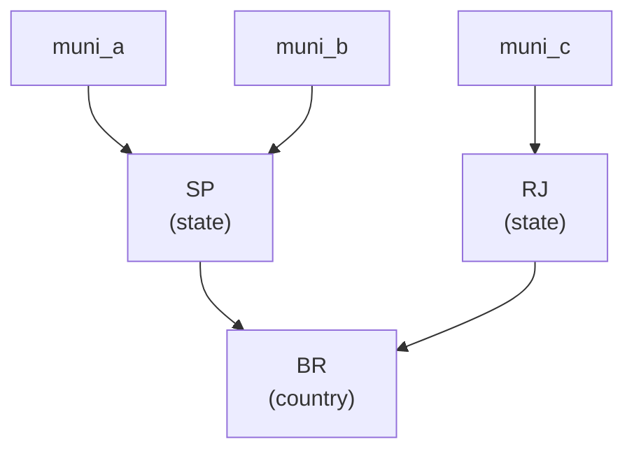

# Hierarchical rollups

Once you have one value per leaf polygon (municipalities, counties, basins), you often
want them rolled up to a parent grouping (states, regions, countries). geohalo treats
this the same way it treats everything else: **as a linear operator** you precompute once
and apply with a matmul.

## The rollup matrix

Let \(\mathbf{a}\) be the leaf values. A rollup to all nodes (leaves *and* internal
parents) is

\[
\mathbf{r} \;=\; \mathbf{R}\,\mathbf{a},
\qquad
\mathbf{R} \in \mathbb{R}^{N_\text{nodes} \times N_\text{leaves}}
\]

Each row of \(\mathbf{R}\) expresses a node as a combination of the **leaves that
transitively contribute to it**:

- a **leaf** row is a single 1 (it is itself);
- an **internal** row is the normalised (for `how="mean"`) or raw (for `how="sum"`)
  weighted combination of its children's rows, composed recursively up the tree.



`BiasTree.compute` builds \(\mathbf{R}\) bottom-up: it sorts nodes by depth, seeds leaf
rows with identity, then for each internal node sums its children's already-built rows
scaled by `w/total` (mean) or `w` (sum). Because children are always shallower than their
parents, one pass suffices.

## Usage

```python
import pandas as pd
import geohalo as ghl

edges = pd.DataFrame(
    {"parent": [("BR", "SP"), ("BR", "SP"), ("BR", "RJ")]},
    index=pd.Index(
        [("BR", "SP", "muni_a"), ("BR", "SP", "muni_b"), ("BR", "RJ", "muni_c")],
        name="child",
    ),
)

rolled = ghl.aggregate_bias(leaf_aggregates, edges)
```

The DataFrame **index is the child**; the `parent` column is its parent. The output
carries every node — leaves *and* internal parents — on the `geom` dim, so you can read
a municipality and its state from the same array.

## Options

| Argument     | Default    | Effect                                                          |
| ------------ | ---------- | --------------------------------------------------------------- |
| `how`        | `"mean"`   | `"mean"` normalises each parent's children; `"sum"` adds them   |
| `weight_col` | `None`     | column of per-edge weights (e.g. child area or population)      |
| `parent_col` | `"parent"` | which column names the parent                                   |

```python
rolled = ghl.aggregate_bias(leaf_aggregates, edges, how="sum")
rolled = ghl.aggregate_bias(leaf_aggregates, edges, weight_col="area")   # area-weighted
```

## Rules geohalo enforces

- **Tree, not DAG.** Each child has at most one parent — `edges.index` must be unique.
  This is checked at build time.
- **No cycles.** Every node must be reachable from some leaf; a cycle (a node unreachable
  from any leaf) raises an error naming the offending nodes.
- **Positive finite weights.** Edge weights must be positive and finite.

## NaN handling

`aggregate_bias_with_tree` mirrors the [masked reduce path](masked.md). If all leaves are
valid it is one clean matmul `a @ R.T`. If some leaves are NaN:

- for `how="mean"`, NaN leaves are **dropped** and the surviving weights renormalised
  (numerator/denominator matmuls, exactly as in the reduce path);
- for `how="sum"`, NaN leaves contribute zero.

A parent whose contributing leaves are all NaN resolves to `NaN`.

## Precompute and cache

Like the stencil, the rollup matrix depends only on the **hierarchy**, not the values —
so it is built once and [cached](../guides/caching.md) via `get_or_compute_tree`. The
hot-path rollup of a batch of 50 slices over the full Brazil muni → state hierarchy
(5 571 leaves) takes a few milliseconds.

```python
import geohalo as ghl

tree = cache.get_or_compute_tree(edges)
rolled = ghl.aggregate_bias_with_tree(leaf_aggregates, tree)
```
