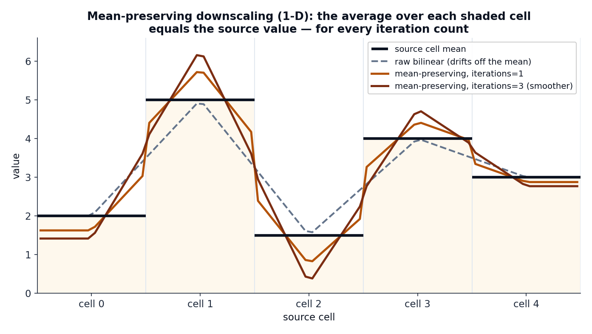

# Mean-preserving downscaling

Many polygons are smaller than a single grid cell. [Exact coverage](exact-coverage.md)
will still answer — it returns the value of the cell the polygon sits in — but that
answer is flat across the whole cell. geohalo can do better by **refining the grid**
first, using neighbouring cells to give sub-cell polygons a sharper estimate.

The catch: a naive upsample (plain bilinear) **drifts off the published cell mean**.
geohalo's `Resampler` refines *without* breaking the contract that the grid encodes —
the average of a parent cell's children equals the parent's original value, exactly.

## The contract

A gridded field publishes **cell means**. A refinement that respects this must satisfy,
for every source cell \(s\) and its set of target children \(\{t : \pi(t) = s\}\):

\[
\frac{1}{n_s}\sum_{\pi(t)=s} y_t \;=\; x_s
\]

Plain bilinear interpolation does not — it smooths across cell boundaries and quietly
shifts each cell's average. The figure below shows the gap in one dimension:

<figure markdown>
{ width="780" }
<figcaption>
A 5-cell source field refined ~16×. Raw bilinear (dashed) is smooth but its average over
each cell no longer equals the source value. The mean-preserving curves (amber/rust) add
a correction so the integral over every shaded cell returns to the source mean — for any
iteration count. More iterations trade a little overshoot for more smoothness.
</figcaption>
</figure>

And on a real ECMWF precipitation field over eastern Brazil:

<figure markdown>
{ width="860" }
<figcaption>
Native cell-mean field, raw bilinear (not mean-preserving), and 1 / 2 / 4 / 10 iterations
of the mean-preserving kernel. Every refined panel preserves each parent cell's mean
exactly; iterations only change smoothness.
</figcaption>
</figure>

## Construction

From the source and target coordinate arrays, geohalo builds three
**value-independent** sparse matrices (`geohalo.resampler._build_factors`):

- \(\mathbf{B}\) — **bilinear interpolation**, target ← source. Separable as
  \(\mathbf{B} = \mathbf{B}_\text{lat} \otimes \mathbf{B}_\text{lon}\), each 1-D factor
  mapping source centres to target centres with clamped edges
  (`bilinear_matrix_1d`).
- \(\pi\) — a **nearest-cell assignment** of each target cell to its parent source cell
  (`nearest_index`). From it:
    - \(\mathbf{P}\) — source → target **broadcast**: \(P_{t,\pi(t)} = 1\).
    - \(\mathbf{A}\) — source ← target **mean**: \(A_{s,t} = 1/n_s\) when
      \(\pi(t) = s\), where \(n_s\) is the number of target cells assigned to source
      cell \(s\). A source cell with no children has an all-zero row.

The refinement is an **interpolate-and-correct** loop, linear in the source values
\(\mathbf{x}\):

\[
\begin{aligned}
\mathbf{y}_0 &= \mathbf{B}\,\mathbf{x} \\[2pt]
\text{smooth} \times (\text{iter}-1): \quad
\mathbf{y} &\leftarrow \mathbf{y} + \mathbf{B}\,(\mathbf{x} - \mathbf{A}\,\mathbf{y}) \\[2pt]
\text{hard correction}: \quad
\mathbf{y} &\leftarrow \mathbf{y} + \mathbf{P}\,(\mathbf{x} - \mathbf{A}\,\mathbf{y})
\end{aligned}
\]

Each line measures the residual between the source value and the current average of its
children (\(\mathbf{x} - \mathbf{A}\mathbf{y}\)) and adds it back — smoothly through
\(\mathbf{B}\) during the iterations, then sharply through \(\mathbf{P}\) at the end.

## Collapsing to a matrix

Because every step is linear, the whole loop collapses to a single transform
\(\mathbf{T}\) with \(\mathbf{y} = \mathbf{T}\mathbf{x}\):

\[
\mathbf{G} = \mathbf{I} - \mathbf{B}\mathbf{A}, \qquad
\mathbf{y}_\text{op} = \Bigl(\sum_{j=0}^{\text{iter}-1} \mathbf{G}^{\,j}\Bigr)\mathbf{B}, \qquad
\mathbf{T} = \mathbf{y}_\text{op} + \mathbf{P}\,(\mathbf{I} - \mathbf{A}\,\mathbf{y}_\text{op})
\]

### Why the mean is preserved exactly

The hard correction is what guarantees the contract. Since \(\mathbf{A}\mathbf{P} =
\operatorname{diag}(n_s > 0)\), applying \(\mathbf{A}\) to \(\mathbf{T}\) gives

\[
\mathbf{A}\mathbf{T} = \mathbf{I}
\]

on every source cell that has at least one child — i.e. averaging a source cell's target
children recovers the source value **exactly**, for any iteration count. This always
holds when refining; when coarsening, a source cell with no assigned target can't be
preserved (geometrically unavoidable, and geohalo leaves those rows zero).

!!! note "The classic operator is the one-iteration case"
    With `iterations = 1` the series has a single term and the transform reduces to the
    textbook downscaling operator
    \(\mathbf{M} = \mathbf{B} + \mathbf{P} - \mathbf{P}\mathbf{A}\mathbf{B}\).
    Higher iteration counts are the N-term generalisation: the correction reaches
    further across the grid, smoothing the result while still preserving every mean.

## Cost: never materialise \(\mathbf{G}\)

\(\mathbf{G} = \mathbf{I} - \mathbf{B}\mathbf{A}\) is an
\(N_\text{target} \times N_\text{target}\) operator that **densifies** under repeated
products — forming its powers directly would be ruinous. geohalo never does. It
accumulates the series by applying \(\mathbf{G}\) to \(\mathbf{B}\) **on the right**, so
every intermediate stays \(N_\text{target} \times N_\text{source}\):

```python
acc = term = B
for _ in range(iterations - 1):
    term = term - B @ (A @ term)   # term @ G, but kept thin
    acc = acc + term
y_op = acc
```

The dense \(N_\text{target}^2\) matrix is never built. The build stays sub-second even
for large refinements; cost grows with `iterations` only because the transform *fills
in* as its reach expands. The default `iterations = 1` is the cheapest.

## Non-negative variables (`floor=`)

The refinement series and the per-block correction are *signed*: near a sharp
gradient (a wet cell beside dry ones) the smooth surface can overshoot below
zero, and the block-constant correction \(\mathbf{P}(x - \mathbf{A}y)\) can push
an entire dry block negative — even though bilinear interpolation alone never
would. For precipitation, wind speed, or concentrations that is unphysical.

`floor=` clips the output at a lower bound **without giving up mean
preservation**. After the linear transform, each source-cell block is clipped
and its deviations-from-floor rescaled in closed form:

\[
y'' = f + \bigl(\max(y, f) - f\bigr)\cdot
      \frac{x_\text{parent} - f}{\overline{\max(y, f) - f}}
\]

so every child stays \(\ge f\) *and* the block's child mean equals the source
value exactly — one pass, no iteration.

```python
fine = ghl.resample_grid(da, target_resolution=0.05, iterations=3, floor=0.0)
```

Details that matter:

- The transform matrix \(\mathbf{T}\) stays linear and cacheable — the floor is
  a value-dependent post-step at apply time, so digests and caches are
  untouched.
- A source cell already below the floor (e.g. a tiny negative precipitation
  artifact in the input) gets its block filled with the floor: the bound is
  guaranteed everywhere, and the mean is knowingly broken only where the input
  itself violated it.
- Blocks whose children all clip are filled with the parent value; NaN blocks
  stay NaN.
- For a `Dataset`, pass a mapping to bound only some variables:
  `floor={"tp": 0.0}`.
- `reduce(..., target_resolution=...)` does **not** take `floor` — the fused
  operator never materialises the fine field, and a nonlinear clip cannot pass
  through the fusion. When per-polygon values must respect the bound, do the
  explicit two-step: `resample_grid(..., floor=0.0)` then `reduce`.

## Two forms of the resampler

geohalo ships the transform in two shapes for two different needs:

| Class               | Holds                          | `compute` cost          | Use when                                          |
| ------------------- | ------------------------------ | ----------------------- | ------------------------------------------------- |
| `Resampler`         | the materialised \(\mathbf{T}\) | builds the full series  | you want the refined **grid** itself              |
| `FactoredResampler` | just \(\mathbf{B}, \mathbf{A}, \mathbf{P}\) | only the three base ops | you only want per-polygon values (the reduce path) |

`Resampler` is what [`resample_grid`](../guides/resampling.md) returns.
`FactoredResampler` is the key to the [fused reduce operator](reduce-operator.md): its
`fuse_left(W)` computes \(\mathbf{W}\mathbf{T}\) without ever materialising
\(\mathbf{T}\), so refining to a multi-million-cell grid stays cheap.

## Using it

```python
import geohalo as ghl

fine = ghl.resample_grid(da, target_resolution=0.05, iterations=3)
```

Or, through `reduce`, when the refinement is only a stepping stone to per-polygon values:

```python
out = ghl.reduce(da, geoms, target_resolution=0.05, resample_iterations=3)
```

In the second form geohalo never builds the fine field at all — it fuses the resample
into the stencil. That is the subject of the [next page](reduce-operator.md).
