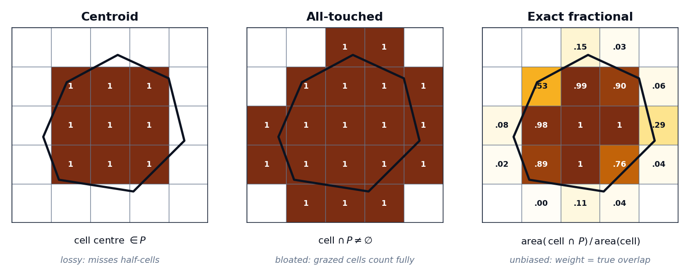

# Why exact fractional coverage

The single most important modelling choice in geohalo is **how a cell on the polygon
boundary is weighted**. Three approaches are common, and they disagree most exactly
where it matters: along the perimeter.

<figure markdown>
{ width="900" }
<figcaption>
The same polygon over a 5×5 mesh, scored three ways. Centroid keeps a cell only if its
centre is inside; all-touched keeps any grazed cell whole; exact fractional weights
each cell by the true overlap area.
</figcaption>
</figure>

## The three methods

=== "Centroid"

    A cell counts (weight 1) if and only if its **centre** falls inside the polygon.

    \[
    W_{ij} = \begin{cases} 1 & \text{centre}_j \in P_i \\ 0 & \text{otherwise} \end{cases}
    \]

    Cheap, but **lossy**: it ignores how much of each boundary cell is actually
    covered, and any polygon smaller than a single cell that doesn't happen to contain
    a centre collapses to **zero cells** — no estimate at all.

=== "All-touched"

    A cell counts (weight 1) if it intersects the polygon **at all**.

    \[
    W_{ij} = \begin{cases} 1 & \text{cell}_j \cap P_i \neq \varnothing \\ 0 & \text{otherwise} \end{cases}
    \]

    Also cheap, but **bloated**: a cell the polygon barely grazes is counted as if
    fully inside, inflating the footprint by roughly half a cell all the way around the
    perimeter.

=== "Exact fractional"

    A cell's weight is the **fraction of its area** the polygon covers.

    \[
    W_{ij} = \frac{\text{area}(\text{cell}_j \cap P_i)}{\text{area}(\text{cell}_j)} \in [0, 1]
    \]

    This is what geohalo uses, via [`exactextract`](https://github.com/isciences/exactextract).
    A boundary cell that is 30 % inside contributes 0.30; a fully interior cell
    contributes 1.0. The weight is proportional to true overlap, so the estimate is
    **unbiased**.

## The bias, quantified

| Method               | Bias                                               | Cost          |
| -------------------- | -------------------------------------------------- | ------------- |
| Centroid             | High; polygons smaller than a cell collapse to 0   | Cheap         |
| All-touched          | Overcounts by ~½-cell around the perimeter         | Cheap         |
| **Exact fractional** | **Unbiased** — weight is the true overlap fraction | One-time only |

The errors from centroid and all-touched are **systematic**, not random: centroid
consistently under-samples the boundary, all-touched consistently over-samples it. They
do not average out across polygons, and they grow as cells get larger relative to the
polygons — exactly the regime of coarse grids over small administrative areas.

## Why the cost stops mattering

Exact coverage is more expensive to compute than a centroid test — but in geohalo it is
computed **once**, baked into the [stencil](stencil.md), and
[cached](../guides/caching.md). Every grid afterwards pays the same fast matmul
regardless of which method built the weights. You buy unbiasedness at precompute time
and never pay for it again, which is why "cheap" no longer recommends the lossy options.

## Sub-cell polygons

Exact coverage gives a sensible answer even when a polygon is smaller than one cell: it
returns that cell's value (the area-weighted mean of the one cell it sits in). That is
the best estimate under a "uniform within a cell" assumption — but geohalo can do better
by refining the grid first with [mean-preserving downscaling](downscaling.md), which
uses neighbouring cells to give sub-cell polygons a sharper, still-unbiased answer.
