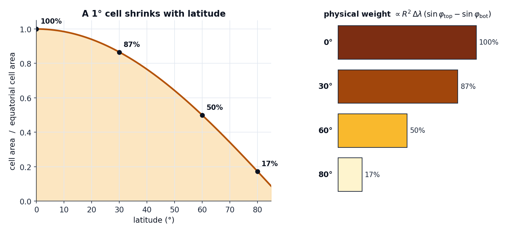

# Latitude correction

[Exact coverage](exact-coverage.md) tells you what *fraction* of each cell a polygon
covers. But a fraction is dimensionless — to weight cells against each other physically,
you need their **areas**. And on a regular lat/lon grid, equal steps in degrees are
**not** equal areas.

## The problem

A 1° × 1° cell spans the same number of degrees everywhere, but as you move toward the
poles the meridians converge, so the cell's footprint on the sphere shrinks. A cell at
60° latitude has only about **half** the area of one at the equator; at 80° it is down
to roughly a sixth.

<figure markdown>
{ width="820" }
<figcaption>
Relative area of a 1° cell as a function of latitude. The same grid spacing in degrees
hides a 6× spread in physical area between the equator and 80°.
</figcaption>
</figure>

If you treated every cell as equal, high-latitude cells would be **over-weighted** in
the mean — a polygon's average would lean toward whatever its poleward cells happen to
say.

## The fix

geohalo multiplies each cell's coverage fraction by its true spherical area before
row-normalising. The area of the cell between latitude edges \(\varphi_\text{bot}\) and
\(\varphi_\text{top}\) and spanning \(\Delta\lambda\) in longitude is the exact integral
of the sphere's surface element:

\[
A \;=\; R^2 \,\Delta\lambda \,\bigl(\sin\varphi_\text{top} - \sin\varphi_\text{bot}\bigr)
\]

with \(R = 6\,371\,008.8\ \text{m}\) (the mean Earth radius) and angles in radians. The
\(\sin\varphi_\text{top} - \sin\varphi_\text{bot}\) term is what bends the curve above:
it is the band-area formula for a sphere, exact for the latitude direction.

This is `geohalo.geometry.cell_areas`:

```python
lat_edges = midpoint_edges(lats)          # N+1 edges from N centres
lon_edges = midpoint_edges(lons)
sin_top = np.sin(np.deg2rad(lat_edges[1:]))
sin_bot = np.sin(np.deg2rad(lat_edges[:-1]))
dlon_rad = np.deg2rad(np.diff(lon_edges))
area_per_lat = (EARTH_RADIUS_M ** 2) * (sin_top - sin_bot)
return area_per_lat[:, None] * dlon_rad[None, :]
```

Each stencil weight is then `coverage × area`, so a half-covered equatorial cell
correctly outweighs a half-covered polar cell.

## Turning it off

For a planar / equal-area treatment — every cell weight 1.0 — pass
`spherical_correction=False`:

```python
out = ghl.reduce(da, geoms, spherical_correction=False)
```

This makes `cell_areas` return all-ones and the weights become pure coverage fractions.
It is the right choice when your grid is already on an equal-area projection, or when you
deliberately want unweighted coverage.

!!! note "Spherical, not ellipsoidal"
    geohalo uses a **spherical** Earth, not the WGS84 ellipsoid. The difference in cell
    area is within ~0.3 %, which is negligible next to the centroid/all-touched bias the
    [coverage choice](exact-coverage.md) removes. Ellipsoidal areas are a deliberate
    non-goal.

## Where it folds in

The correction lives entirely inside the [stencil](stencil.md) build — it is part of
the precompute, so it costs nothing at apply time. The `spherical_correction` flag is
also mixed into the stencil's [cache digest](../guides/caching.md) (`b"sph"` vs
`b"flat"`), so a spherical stencil and a planar one never collide in the cache.
