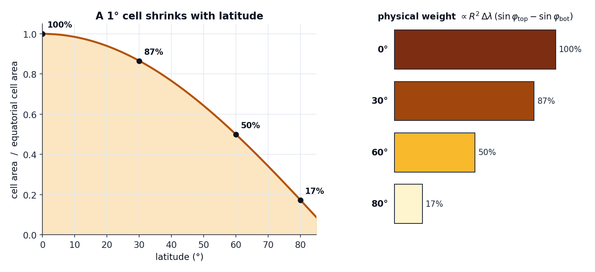

# Latitude correction

[Exact coverage](exact-coverage.md) tells you what *fraction* of each cell a polygon
covers. But a fraction is dimensionless — to weight cells against each other physically,
you need their **areas**. And on a regular lat/lon grid, equal steps in degrees are
**not** equal areas.

## The problem

A 1° × 1° cell spans the same number of degrees everywhere, but as you move toward the
poles the meridians converge, so the cell's footprint on the sphere shrinks. A cell at
60° latitude has only about **half** the area of one at the equator; at 80° it is down
to roughly a sixth.

<figure markdown>
{ width="820" }
<figcaption>
Relative area of a 1° cell as a function of latitude. The same grid spacing in degrees
hides a 6× spread in physical area between the equator and 80°.
</figcaption>
</figure>

If you treated every cell as equal, high-latitude cells would be **over-weighted** in
the mean — a polygon's average would lean toward whatever its poleward cells happen to
say.

## The fix

geohalo multiplies each cell's coverage fraction by its true spherical area before
row-normalising. The area of the cell between latitude edges \(\varphi_\text{bot}\) and
\(\varphi_\text{top}\) and spanning \(\Delta\lambda\) in longitude is the exact integral
of the sphere's surface element:

\[
A \;=\; R^2 \,\Delta\lambda \,\bigl(\sin\varphi_\text{top} - \sin\varphi_\text{bot}\bigr)
\]

with \(R = 6\,371\,008.8\ \text{m}\) (the mean Earth radius) and angles in radians. The
\(\sin\varphi_\text{top} - \sin\varphi_\text{bot}\) term is what bends the curve above:
it is the band-area formula for a sphere, exact for the latitude direction.

This is `geohalo.geometry.cell_areas`:

```python
lat_edges = midpoint_edges(lats)          # N+1 edges from N centres
lon_edges = midpoint_edges(lons)
sin_top = np.sin(np.deg2rad(lat_edges[1:]))
sin_bot = np.sin(np.deg2rad(lat_edges[:-1]))
dlon_rad = np.deg2rad(np.diff(lon_edges))
area_per_lat = (EARTH_RADIUS_M ** 2) * (sin_top - sin_bot)
return area_per_lat[:, None] * dlon_rad[None, :]
```

Each stencil weight is then `coverage × area`, so a half-covered equatorial cell
correctly outweighs a half-covered polar cell.

## Turning it off

For a planar / equal-area treatment — every cell weight 1.0 — pass
`spherical_correction=False`:

```python
out = ghl.reduce(da, geoms, spherical_correction=False)
```

This makes `cell_areas` return all-ones and the weights become pure coverage fractions.
It is the right choice when your grid is already on an equal-area projection, or when you
deliberately want unweighted coverage.

!!! note "Spherical, not ellipsoidal"
    geohalo uses a **spherical** Earth, not the WGS84 ellipsoid. The difference in cell
    area is within ~0.3 %, which is negligible next to the centroid/all-touched bias the
    [coverage choice](exact-coverage.md) removes. Ellipsoidal areas are a deliberate
    non-goal.

## Where it folds in

The correction lives entirely inside the [stencil](stencil.md) build — it is part of
the precompute, so it costs nothing at apply time. The `spherical_correction` flag is
also mixed into the stencil's [cache digest](../guides/caching.md) (`b"sph"` vs
`b"flat"`), so a spherical stencil and a planar one never collide in the cache.

## Polygon areas

Use `geohalo.geometry.polygon_areas` to measure zones with the same spherical
surface element and radius as `cell_areas`:

```python
from geohalo.geometry import polygon_areas
from shapely import box

# A GeoSeries or one-dimensional sequence, in longitude/latitude degrees.
area_m2 = polygon_areas([box(-10, 40, 10, 50)])
# With a GeoSeries, the output positions follow its order, including duplicate keys:
# area_m2 = polygon_areas(geoms)
```

The result is a one-dimensional float64 NumPy array, not an indexed Series.
`None` produces NaN. Empty geometries, points, and lines have zero area. Polygon
holes are subtracted regardless of winding direction. MultiPolygon and nested
GeometryCollection members contribute additively; collections are not unioned
and overlapping members can therefore be counted more than once. Z is ignored.

### Edge convention and integration

Edges are straight in the supplied longitude/latitude coordinate plane, consistent
with [Shapely's coordinate model](https://shapely.readthedocs.io/en/stable/manual.html#coordinate-systems).
They are not great-circle arcs, and this is not an ellipsoidal geodesic area.
For each ring we use the spherical surface integral as a boundary integral:

\[
A_{\rm ring} = R^2\left|\oint \sin\varphi\,d\lambda\right|.
\]

For a linear edge, let \(m=(\varphi_0+\varphi_1)/2\) and
\(h=(\varphi_1-\varphi_0)/2\). Its integral is
\(\Delta\lambda\sin(m)\sin(h)/h\), with the ratio defined as 1 when
\(h=0\). Thus both horizontal and sloping edges are integrated analytically;
adding collinear vertices does not change the geometric area. The implementation
subtracts a reference sine and uses a small-angle expansion to reduce floating-point
cancellation for small or near-pole polygons.

### Longitude and input validation

Longitudes are used as supplied, **without wrapping** or selecting a shorter arc.
`box(-170, -10, 170, 10)` covers 340 degrees of longitude, not 20. For a narrow
antimeridian-crossing polygon, unwrap its coordinates (for example, a box from
170 to 190) or split it into polygons on either side of the seam. Each polygon
must span at most 360 degrees; a full globe such as `box(-180, -90, 180, 90)`
has area \(4\pi R^2\). This helper does not alter the longitude handling of
stencils or reducers.

Coordinates must be finite, latitude must lie in [-90, 90], and geometries must
be topologically valid. Invalid data raises `ValueError` rather than being repaired
or clipped. Non-geometry elements raise `TypeError`. A GeoSeries with a declared
CRS must use EPSG:4326 or an equivalent CRS (such as OGC:CRS84); unlabelled inputs
are assumed to contain lon/lat degrees. No reprojection is performed. For planar
area in coordinate units, use `shapely.area` instead.

### Comparing with stencil weights

`polygon_areas(geoms)` and a spherical stencil's `row_sums` are expressed in the
same m² and use the same radius, but they need not be numerically identical.
Stencil weights multiply **planar coverage fractions** by whole-cell spherical
areas. That approximates the spherical area of partially covered cells. A polygon
made entirely of whole grid cells agrees with their summed areas; a partial-cell
boundary generally does not, even if the polygon is a lat/lon rectangle.

The stencil also only includes the portion inside its grid footprint. Ratios
against `polygon_areas` are therefore approximate coverage diagnostics, not an
exact coverage fraction guaranteed to lie in [0, 1]. This helper leaves existing
stencil construction and reduction results unchanged.
