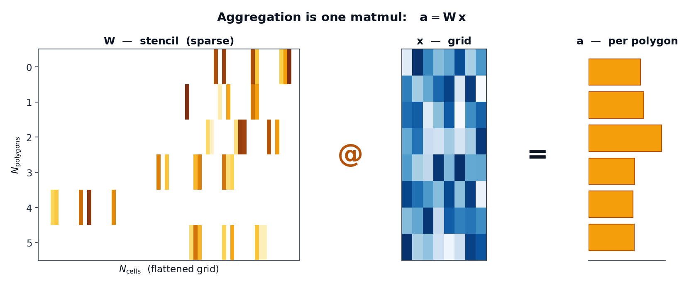
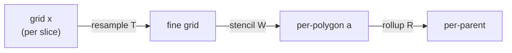

# Aggregation as a linear operator

Everything geohalo does grows from one observation: **zonal aggregation is a linear
map from grid cells to polygons.**

## The map

Flatten a gridded field of \(N_\text{cells}\) grid cells into a vector \(\mathbf{x}\).
Computing one value per polygon — the area-weighted mean (or sum) of the cells each
polygon covers — is a matrix-vector product:

\[
\mathbf{a} \;=\; \mathbf{W}\,\mathbf{x},
\qquad
\mathbf{W} \in \mathbb{R}^{N_\text{polygons} \times N_\text{cells}}
\]

Row \(i\) of \(\mathbf{W}\) holds the weights polygon \(i\) places on each cell: the
**exact fractional area** of `cell ∩ polygon`, multiplied by the cell's true area on
the sphere. Cells the polygon never touches are zero — so \(\mathbf{W}\) is very
sparse (each polygon touches a handful of cells out of millions).

<figure markdown>
{ width="760" }
<figcaption>
The stencil <strong>W</strong> (sparse, one row per polygon) times the flattened
grid <strong>x</strong> yields one value per polygon. Only the matmul touches the
data — and it is the only thing that runs per input grid.
</figcaption>
</figure>

## Why this framing pays off

Because \(\mathbf{W}\) is built from **geometry alone**, it has nothing to do with the
grid values. That single fact drives the whole design:

- **Build once, apply forever.** \(\mathbf{W}\) depends only on `(grid, polygons)`.
  Compute it one time, [cache it](../guides/caching.md), and every subsequent
  grid — every time step, ensemble member, or band — is just another \(\mathbf{x}\)
  fed through the same operator.

- **Batch for free.** Stack \(B\) grid slices into a dense
  \(\mathbb{R}^{B \times N_\text{cells}}\) matrix and the aggregation of all of them is
  a single sparse · dense product. A `(member=50, step=40)` batch — 2 000 slices —
  flattens, runs *one* matmul, and reshapes back.

- **Composition is multiplication.** Any other linear step folds into the same
  operator. Refining the grid first? That is a resample matrix \(\mathbf{T}\);
  the combined operation is \(\mathbf{W}\mathbf{T}\) — still one matmul
  (see [the fused operator](reduce-operator.md)). Rolling polygons up a hierarchy?
  Another sparse matrix \(\mathbf{R}\) (see [hierarchical rollups](bias-tree.md)).

The cost lives entirely in the arrows that depend on geometry, and they are all
precomputed. The hot path is one `flat @ M.T`.

## Mean vs sum

The raw product \(\mathbf{W}\mathbf{x}\) is an area-weighted **sum** of weighted
cell values. To get the **mean**, divide each polygon's result by its total
overlap area — the row sum of \(\mathbf{W}\):

\[
a_i^{\text{mean}} \;=\; \frac{(\mathbf{W}\mathbf{x})_i}{\sum_j W_{ij}}
\]

geohalo precomputes those row sums once (`Stencil.row_sums`) so `how="mean"` stays a
division by a cached vector. `how="sum"` skips the division entirely.

## What this *isn't*

A linear operator cannot, by itself, handle data-dependent decisions — and geohalo is
honest about that boundary:

- **Missing data (NaN).** When some cells are invalid, the per-polygon normaliser must
  be recomputed *per slice* from the valid mask. That can't be baked into a single
  fixed matrix, so geohalo falls back to a [NaN-aware path](masked.md) that uses a
  second matmul against the validity mask. Clean data takes the pure single-matmul
  path.
- **`min` / `max`.** These are not linear, so they are out of scope. geohalo does
  `mean` and `sum` only.

Read on: [the stencil](stencil.md) is the concrete object that holds \(\mathbf{W}\).
