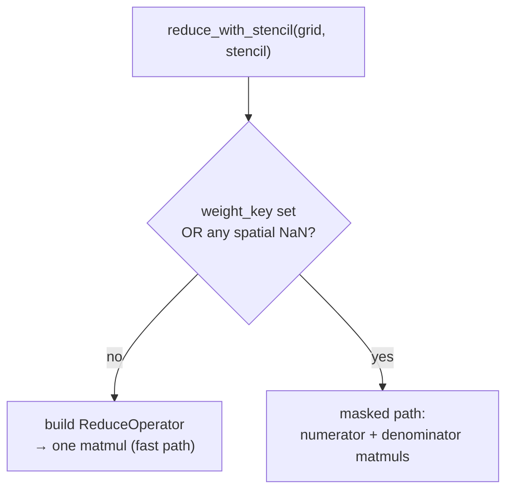

# NaN-aware & weighted reduction

The [single-matmul fast path](reduce-operator.md) assumes clean data: every cell is
valid and every cell counts equally. Two situations break that assumption, and geohalo
handles both by **renormalising per slice** instead of trusting a fixed denominator.

## Why a fixed operator can't do it

The mean is \((\mathbf{W}\mathbf{x})_i\) divided by polygon \(i\)'s total overlap area,
the row sum \(\sum_j W_{ij}\). That denominator is baked into the operator — correct
only when every cell under the polygon contributes.

But if some cells are **NaN** (missing data — outside the model domain, masked ocean,
etc.), those cells must drop out of *both* the numerator and the denominator, and which
cells are NaN can differ from slice to slice. The same goes for **per-cell weights**: a
population-weighted mean divides by the weighted valid area, not the geometric area. No
single precomputed scalar captures a per-slice mask, so geohalo recomputes the
denominator on the fly with a second matmul.

## The masked path

`reduce_with_stencil` picks the path automatically:



For the masked path, with the stencil's occupancy matrix \(\mathbf{W}\), a validity mask
\(\mathbf{v}\) (1 where valid, 0 where NaN), and optional per-cell weights \(\mathbf{w}\):

\[
a_i \;=\; \frac{\sum_j W_{ij}\, w_j\, v_j\, x_j}{\sum_j W_{ij}\, w_j\, v_j}
\]

Both sums are matmuls against \(\mathbf{W}\): the **numerator** projects the
weight-and-mask-applied values, the **denominator** projects the weights-times-mask. The
ratio is the renormalised mean, computed fresh for each slice's mask — without rebuilding
\(\mathbf{W}\).

```python
# from geohalo.api._project_masked (mean, unweighted)
valid = ~np.isnan(resampled)
numer = (occ @ np.where(valid, resampled, 0.0).T).T
denom = (occ @ valid.astype(np.float64).T).T
return np.where(denom > 0, numer / denom, np.nan)
```

A polygon all of whose cells are NaN gets `denom == 0` and resolves to `NaN` rather than
a divide-by-zero — missing in, missing out.

!!! note "An allocation geohalo skips"
    In the unweighted case the per-cell weight is just 1, so geohalo does **not**
    materialise a full ones-array or run the two no-op multiplies. On a 50×4 batch
    those skipped `(batch, n_cells)` allocations would run to gigabytes — visible in the
    benchmarks as the masked-vs-clean memory gap.

## `how="sum"` under masking

For a sum there is no denominator to renormalise — invalid cells simply contribute zero:

\[
a_i \;=\; \sum_j W_{ij}\, w_j\, v_j\, x_j
\]

geohalo returns the numerator directly and skips the denominator matmul.

## Per-cell weights

Name a weight variable with `weight_key`. It is resolved on the grid being reduced,
broadcast to match each data variable's batch shape, and (when refining) passed through
the same resampler as the data. Build a per-cell weight field, attach it to the data, and
reduce against it — a complete runnable example:

```python
import numpy as np
import geopandas as gpd
import xarray as xr
from shapely.geometry import box
import geohalo as ghl

lats = np.arange(-25.0, -19.0, 0.25)
lons = np.arange(-50.0, -42.0, 0.25)
lon2d, lat2d = np.meshgrid(lons, lats)

da = xr.DataArray(
    290.0 + 5.0 * np.cos(np.deg2rad(4 * lat2d)) + 0.1 * lon2d,
    dims=("latitude", "longitude"),
    coords={"latitude": lats, "longitude": lons},
    name="t2m",
)
geoms = gpd.GeoSeries([box(-49, -24, -47, -22), box(-46, -22, -44, -20)], index=["SP", "MG"])

# a per-cell weight field (e.g. population) on the same grid, attached as a coordinate
weight = np.abs(np.random.default_rng(0).normal(1000.0, 400.0, size=da.shape))
da_w = da.assign_coords(population=(("latitude", "longitude"), weight))

out = ghl.reduce(da_w, geoms, weight_key="population")   # population-weighted mean
print(out.values)
```

A NaN in the weight field drops that cell too — the validity mask is
`~isnan(value) & ~isnan(weight)`.

## Cost

The masked path is slower than the clean path — two matmuls instead of one, plus the
mask arithmetic — but still milliseconds. With a 1 % NaN mask over 5 571 polygons and a
batch of 50 slices it runs in ~14 ms, versus ~6 ms clean (see the
[benchmarks](../performance.md)). When a grid resample is also needed, the masked path
keeps the resampler **factored** (`FactoredResampler`) and applies it per slice, rather
than fusing it — because fusion would re-bake the denominator it is trying to keep live.
