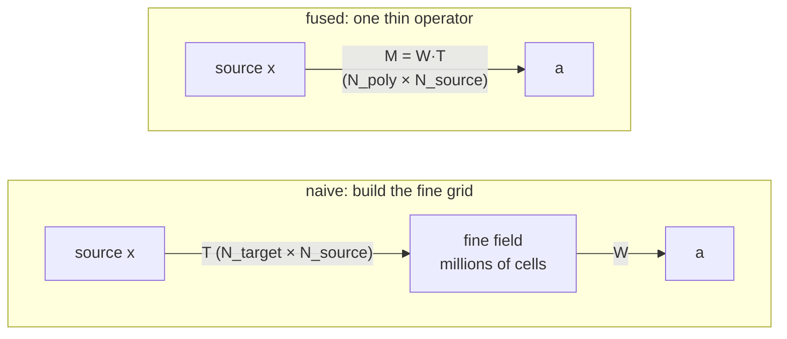

# The fused reduce operator

When you reduce over a **refined** grid, two linear maps stand between the source data
and the answer: a [resampler](downscaling.md) \(\mathbf{T}\) (source → fine grid) and a
[stencil](stencil.md) \(\mathbf{W}\) (fine grid → polygons).

\[
\mathbf{a} \;=\; \mathbf{W}\,(\mathbf{T}\,\mathbf{x}) \;=\; (\mathbf{W}\mathbf{T})\,\mathbf{x}
\]

The naive route builds \(\mathbf{T}\), applies it to make a fine field, then applies
\(\mathbf{W}\). But \(\mathbf{T}\) spans the **entire fine grid** — millions of cells —
even though only the handful of cells under each polygon will ever survive the
multiplication by \(\mathbf{W}\). That is enormous wasted work and memory.

## The fusion

By associativity, the two operators compose into **one**:

\[
\mathbf{M} \;=\; \mathbf{W}\mathbf{T} \;\in\; \mathbb{R}^{N_\text{polygons} \times N_\text{source}}
\]

\(\mathbf{M}\) acts directly on the source grid. It has only \(N_\text{polygons}\) rows,
so it is *tiny* — and crucially, geohalo builds it **without ever materialising
\(\mathbf{T}\)**. `FactoredResampler.fuse_left(W)` pushes the thin \(\mathbf{W}\) through
the resampler's factored form:

\[
\mathbf{T} = \mathbf{y}_\text{op} + \mathbf{P}(\mathbf{I} - \mathbf{A}\mathbf{y}_\text{op}),
\quad \mathbf{y}_\text{op} = \Bigl(\textstyle\sum_j \mathbf{G}^j\Bigr)\mathbf{B}
\]

\[
\Longrightarrow\quad
\mathbf{W}\mathbf{T} = \mathbf{W}\mathbf{P} + (\mathbf{W} - \mathbf{W}\mathbf{P}\mathbf{A})\Bigl(\textstyle\sum_j \mathbf{G}^j\Bigr)\mathbf{B}
\]

and the series is accumulated by **right-applying** \(\mathbf{G}\) to the thin
\((\mathbf{W} - \mathbf{W}\mathbf{P}\mathbf{A})\). Every intermediate keeps only
\(N_\text{polygons}\) rows, so the fusion scales to high iteration counts and
huge target grids where \(\mathbf{T}\) itself would not fit in memory.



## Why it matters: the size win

The fused operator is the most compact thing to cache, and — unlike \(\mathbf{T}\) — its
size **does not grow with target resolution or iteration count**.

<figure markdown>
{ width="780" }
<figcaption>
A 0.25° → 0.05° refine (~3.2 M target cells) over 500 polygons. The materialised
resampler is a 358 MB cache blob that <strong>cannot even build</strong> at
iterations=3. The fused ReduceOperator is 0.40 MB, builds in ~0.5 s, and loads in
~0.5 ms — the same answer, roughly 900× smaller.
</figcaption>
</figure>

## `ReduceOperator`

`ReduceOperator.compute(stencil, source_lat, source_lon, iterations=…)` returns the
stencil's own matrix unchanged when the source grid already matches the stencil grid
(no resample needed), and otherwise calls `fuse_left`. Applying it is a single matmul on
the source grid:

```python
import geohalo as ghl

op = cache.get_or_compute_reduce_operator(
    stencil, da.latitude.values, da.longitude.values, iterations=3,
)
out = ghl.reduce_with_operator(da, op)     # (..., geom); also accepts how="sum"
```

!!! warning "Clean data only"
    `reduce_with_operator` assumes non-NaN, unweighted data — the fused operator bakes
    in a fixed normaliser and cannot renormalise per cell. For missing values or
    per-cell weights, use [`reduce_with_stencil`](masked.md), which keeps the resampler
    factored and renormalises each slice.

## It's already your fast path

You rarely call this directly. `reduce` and `reduce_with_stencil` use exactly this
fusion internally for clean data: they build a `ReduceOperator` once and delegate to
`reduce_with_operator`. The reason to cache the operator yourself is **repetition** — if
you apply the same `(stencil, source grid, iterations)` across many grid slices (time
steps, members, bands) or repeated runs, caching the fused operator skips even the (cheap) fusion step and
loads a sub-millisecond blob. See [caching](../guides/caching.md).
