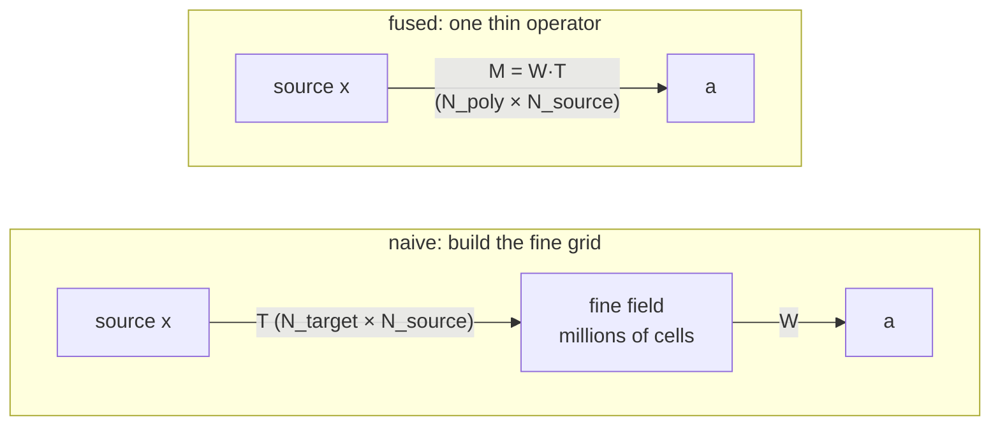
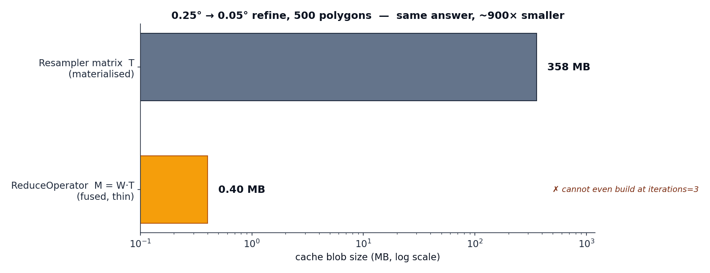

# The fused reduce operator

When you reduce over a **refined** grid, two linear maps stand between the source data
and the answer: a [resampler](downscaling.md) \(\mathbf{T}\) (source → fine grid) and a
[stencil](stencil.md) \(\mathbf{W}\) (fine grid → polygons).

\[
\mathbf{a} \;=\; \mathbf{W}\,(\mathbf{T}\,\mathbf{x}) \;=\; (\mathbf{W}\mathbf{T})\,\mathbf{x}
\]

The naive route builds \(\mathbf{T}\), applies it to make a fine field, then applies
\(\mathbf{W}\). But \(\mathbf{T}\) spans the **entire fine grid** — millions of cells —
even though only the handful of cells under each polygon will ever survive the
multiplication by \(\mathbf{W}\). That is enormous wasted work and memory.

## The fusion

By associativity, the two operators compose into **one**:

\[
\mathbf{M} \;=\; \mathbf{W}\mathbf{T} \;\in\; \mathbb{R}^{N_\text{polygons} \times N_\text{source}}
\]

\(\mathbf{M}\) acts directly on the source grid. It has only \(N_\text{polygons}\) rows,
so it is *tiny* — and crucially, geohalo builds it **without ever materialising
\(\mathbf{T}\)**. `FactoredResampler.fuse_left(W)` pushes the thin \(\mathbf{W}\) through
the resampler's factored form:

\[
\mathbf{T} = \mathbf{y}_\text{op} + \mathbf{P}(\mathbf{I} - \mathbf{A}\mathbf{y}_\text{op}),
\quad \mathbf{y}_\text{op} = \Bigl(\textstyle\sum_j \mathbf{G}^j\Bigr)\mathbf{B}
\]

\[
\Longrightarrow\quad
\mathbf{W}\mathbf{T} = \mathbf{W}\mathbf{P} + (\mathbf{W} - \mathbf{W}\mathbf{P}\mathbf{A})\Bigl(\textstyle\sum_j \mathbf{G}^j\Bigr)\mathbf{B}
\]

and the series is accumulated by **right-applying** \(\mathbf{G}\) to the thin
\((\mathbf{W} - \mathbf{W}\mathbf{P}\mathbf{A})\). Every intermediate keeps only
\(N_\text{polygons}\) rows, so the fusion scales to high iteration counts and
huge target grids where \(\mathbf{T}\) itself would not fit in memory.


```mermaid
flowchart LR
    subgraph naive ["naive: build the fine grid"]
        direction LR
        X1["source x"] -->|"T (N_target × N_source)"| FINE["fine field<br/>millions of cells"]
        FINE -->|"W"| A1["a"]
    end
    subgraph fused ["fused: one thin operator"]
        direction LR
        X2["source x"] -->|"M = W·T<br/>(N_poly × N_source)"| A2["a"]
    end
```

## Why it matters: the size win

The fused operator is the most compact thing to cache, and — unlike \(\mathbf{T}\) — its
size **does not grow with target resolution or iteration count**.

<figure markdown>
{ width="780" }
<figcaption>
A 0.25° → 0.05° refine (~3.2 M target cells) over 500 polygons. The materialised
resampler is a 358 MB cache blob that <strong>cannot even build</strong> at
iterations=3. The fused ReduceOperator is 0.40 MB, builds in ~0.5 s, and loads in
~0.5 ms — the same answer, roughly 900× smaller.
</figcaption>
</figure>

## `ReduceOperator`

`ReduceOperator.compute(stencil, source_lat, source_lon, iterations=…)` returns the
stencil's own matrix unchanged when the source grid already matches the stencil grid
(no resample needed), and otherwise calls `fuse_left`. Applying it uses this fused
matrix directly on the source grid:

```python
import geohalo as ghl

op = cache.get_or_compute_reduce_operator(
    stencil, da.latitude.values, da.longitude.values, iterations=3,
)
out = ghl.reduce_with_operator(da, op)     # (..., geom); also accepts how="sum"
```

Matrix rows, `row_sums`, and output values follow `stencil.keys`, which preserves
the caller's polygon order. Cache hits return that same requested order even
when another caller populated the entry in a different order.

### Opt-in source-cell NaN handling

Contributing NaNs propagate by default, preserving existing behavior. Pass
`skipna=True` to omit missing **source** cells and renormalize each mean over
the surviving signed weights:

```python
out = ghl.reduce_with_operator(da, op, skipna=True)
totals = ghl.reduce_with_operator(da, op, how="sum", skipna=True)
```

An all-missing zone has a NaN mean and a zero sum. Means also return NaN when
the surviving signed weight is zero or negative. Only NaNs are excluded;
infinities are not treated as missing. Sums retain the original weights and
do not extrapolate the total over missing area.

Without resampling, this agrees with the unweighted masked stencil path.
With fused resampling, it is a **different operation** from resampling first
and then masking target cells. Negative resampling coefficients are retained:
a positive surviving denominator does not guarantee a bounded or well-conditioned
mean, especially if signed weights nearly cancel. No clipping is applied.
For target-cell masking or per-cell weights, use
[`reduce_with_stencil`](masked.md).

The same opt-in is available on `reduce_with_restricted_operator` and
`RestrictedOperator.apply`. Low-level callers can use
`op.apply_grid(values, how="mean", skipna=True)`; `apply_grid` still defaults
to an unnormalized sum, unlike the higher-level reducers.

## Application memory

`reduce_with_operator` reads values in their stored latitude order. For large
grids, it gathers the source cells referenced by the matrix and applies one
sparse-vector product per batch slice. The compact column mapping is prepared
once per operator instance and reused, including across Dataset variables.
Operators that touch most cells use the full source slice. Small contiguous grids
use bounded batches to keep multiplication overhead low.

NaN-aware application processes one slice at a time. Clean slices use the
cached normalizer and one sparse product; a masked mean uses a second product
for its denominator. Masked sums still need only one. Masks and sanitized
values are temporary per-slice arrays, never full-batch copies. Enabling this
option does not change operator digests or require rebuilding caches.

Temporary dense storage therefore depends on one slice's contributing cells,
rather than the total number of slices. The original matrix coefficient order
and float64 precision are preserved, including for float32 input. Canonical
matrices and disk/Redis cache payloads retain their existing format.

This bounds the arithmetic's temporary memory; lazy inputs are still loaded in
full by this entry point. To read only contributing chunks, opt in to
[`RestrictedOperator` and `reduce_with_restricted_operator`](restricted-operator.md).

## It's already your fast path

You rarely call this directly. `reduce` and `reduce_with_stencil` use exactly this
fusion internally for clean data: they build a `ReduceOperator` once and delegate to
`reduce_with_operator`. The reason to cache the operator yourself is **repetition** — if
you apply the same `(stencil, source grid, iterations)` across many grid slices (time
steps, members, bands) or repeated runs, caching the fused operator skips even the (cheap) fusion step and
loads a sub-millisecond blob. See [caching](../guides/caching.md).
