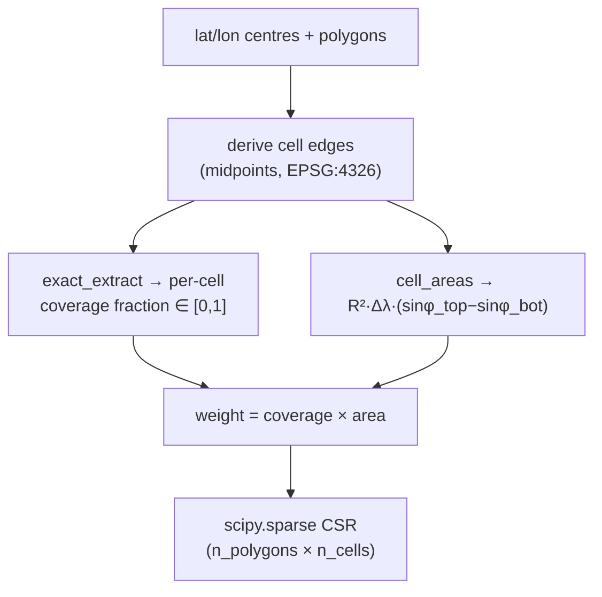
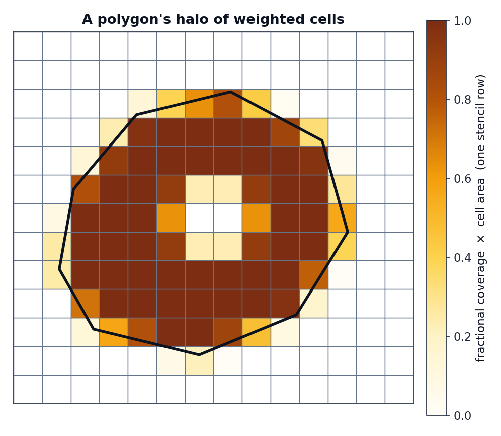

# The stencil

The `Stencil` is geohalo's concrete realisation of the operator \(\mathbf{W}\) from
[the previous page](linear-operator.md). It is a frozen dataclass wrapping a sparse
matrix and just enough metadata to apply and validate it.

## How it is built

`Stencil.compute(lats, lons, geoms)` runs a fixed pipeline:



1. **Canonicalise the grid.** Latitudes are flipped to ascending and both axes are
   checked for regular spacing — `exactextract`'s raster model assumes a uniform
   EPSG:4326 grid, and an irregular axis would silently misplace coverage fractions.

2. **Sort the polygons by key.** `repr(key)` ordering makes the build (and its
   [digest](../guides/caching.md)) independent of the order you passed geometries in.

3. **Exact coverage.** A `NumPyRasterSource` describes the grid's bounding box;
   [`exact_extract`](https://github.com/isciences/exactextract) returns, for each
   polygon, the list of `cell_id`s it touches and the fraction of each cell covered.
   This is the unbiased boundary treatment — see
   [why exact fractional coverage](exact-coverage.md).

4. **Weight by area.** Each coverage fraction is multiplied by the cell's true
   spherical area, so a half-covered equatorial cell outweighs a half-covered polar
   one. See [latitude correction](latitude-correction.md).

5. **Assemble CSR.** The `(polygon, cell, weight)` triples become a
   `scipy.sparse.csr_matrix` — the `occupancy_matrix`.

!!! note "cell_id → grid index"
    `exactextract` numbers cells from the top-left with longitude fastest. geohalo
    converts back to its ascending-latitude convention with
    `row_asc = n_lat - 1 - cell_id // n_lon` and `col = cell_id % n_lon`, so the
    matrix columns line up with a `flat = arr.reshape(-1, n_lat * n_lon)` of the data.

## What a row looks like

One row of the occupancy matrix is a polygon's **halo** — the weighted set of cells it
overlaps. Interior cells get their full area; boundary cells get a fraction; a hole in
the polygon punches the weights back out.

<figure markdown>
{ width="520" }
<figcaption>
A single stencil row over a 13×14 mesh. Deep cells are fully inside; pale cells
straddle the boundary; the cleared centre is a hole in the polygon. This row, dotted
with the matching cells of the data vector, is the polygon's aggregate.
</figcaption>
</figure>

## `row_sums` and normalisation

`__post_init__` precomputes `row_sums = occupancy_matrix.sum(axis=1)` — each polygon's
total overlap area. That vector is the denominator for `how="mean"`, so the mean hot
path never re-sums the matrix.

## Empty overlaps are errors, not silent zeros

If a polygon does not intersect the grid at all — or its overlap area rounds to zero —
geohalo raises `EmptyOverlapError(geom_key)` rather than emitting an all-zero row that
would later divide to `NaN`. This surfaces grid/polygon mismatches early.

```python
import geohalo as ghl

try:
    stencil = ghl.Stencil.compute(lats, lons, geoms)
except ghl.EmptyOverlapError as e:
    print(f"polygon {e.geom_key} falls outside the grid")
```

## Cost

Building a stencil is the expensive step — it scales with the number of polygons and
their vertex count, since `exactextract` clips every polygon against the raster. The
resulting CSR matrix, by contrast, is tiny (kilobytes to a few megabytes) and is what
you [cache](../guides/caching.md). See the
[`Stencil.compute` rows](../performance.md) in the benchmarks.

| n_polygons (Brazil L2) | build time | CSR size |
| ---------------------- | ---------- | -------- |
| 50                     | ~21 ms     | 6 KB     |
| 507                    | ~170 ms    | 38 KB    |
| 5571                   | ~2.1 s     | 430 KB   |

Once built, applying it to a batch of 50 grid slices takes a few **milliseconds**.
