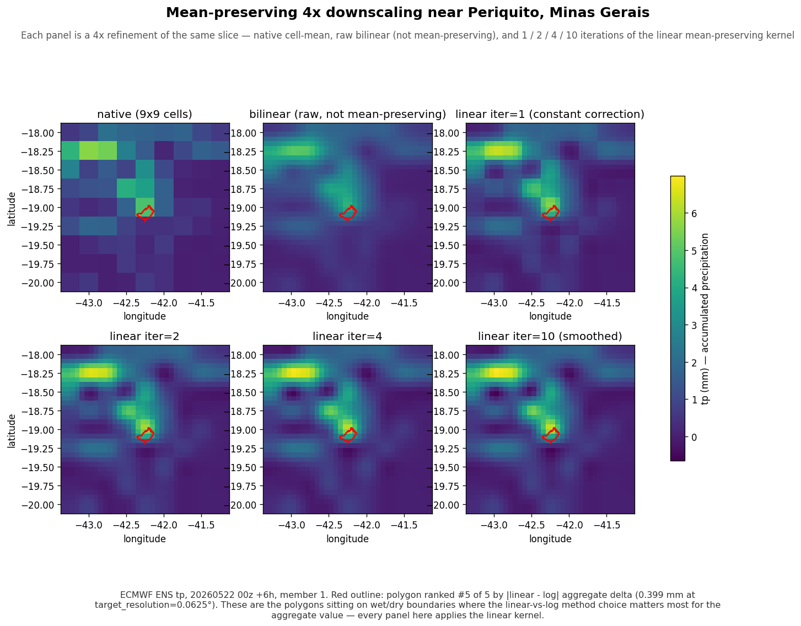

# Mean-preserving downscaling

This document describes the optional **linear mean-preserving downscaling**
kernel that `geohalo` applies before the polygon matmul when
`downscale_factor > 1`. It covers the problem, the algorithm, the API
surface, and benchmark results for `t2m` (temperature) and `tp` (total
precipitation) from an ECMWF ENS forecast over a few hundred Brazilian
polygons.

---

## 1. Why downscaling exists

Weather model output is published as **cell means**: every grid value is
the average of the modelled field over that cell's area. For most
polygons this is fine — they span many cells and the cell-mean assumption
washes out. But many leaf polygons (municipalities, wind farms, small
zones) are **smaller than one grid cell** (a 0.2° ECMWF ENS cell is
~22 km × 22 km; many are 10–15 km across).

When a polygon fits entirely inside one cell, `compute_weights` assigns
that cell a weight of `1.0`. The polygon's reported value is then
exactly the cell mean, regardless of which corner of the cell the
polygon actually sits in or what's happening in neighbouring cells. This
is the unbiased estimator under a "field is uniform within a cell"
assumption — but real fields are not uniform.

Downscaling refines the grid `factor×` per axis (so factor=4 → 16
sub-cells per parent), constructs sub-cell values from neighbour
information, **preserving the parent cell mean exactly**, and lets the
existing polygon matmul resolve the sub-cell pattern. Sub-cell polygons
end up reporting a neighbour-informed estimate; large polygons see the
same answer as before (their area average is unchanged).

```
  Before                              After downscaling, factor=4
  (one polygon ⊂ one cell)            (polygon spans 16 sub-cells of one parent)

  ┌─────────────┐                     ┌──┬──┬──┬──┐
  │             │                     │  │  │  │  │
  │   ┌──┐      │                     ├──┼──┼──┼──┤
  │   │P │      │   →                 │  │ ┌P┐  │   ← polygon now overlaps multiple
  │   └──┘      │                     ├──┤ └─┘  │     sub-cells, each with its own
  │             │                     ├──┼──┼──┼──┤   neighbour-informed value
  │             │                     │  │  │  │  │
  └─────────────┘                     └──┴──┴──┴──┘
  P's value = cell mean               P's value = area-weighted mean of sub-cells
                                                   (still respects parent mean)
```

Visualised on a real `tp` slice from an ECMWF ENS forecast (factor=4),
zoomed into one polygon:



Six panels: the red outline is the polygon. The chunky staircase in the
**native** panel is the cell-mean assumption at full strength.
**bilinear (raw)** smooths the staircase but drifts off each parent's
mean — for any polygon contained in a single parent cell this would
shift the answer relative to the published cell value.

The four `linear iter=N` panels apply N passes of bilinearly-distributed
drift correction, each followed by a final hard correction step that
restores exact mean preservation. At **iter=1** (the cached operator's
behaviour) the correction is constant per parent block, which produces
visible blocky seams at parent boundaries when adjacent parents need
corrections in opposite directions — most obvious in the bright wet
band where two parents jump across an interface. **iter=2** already
softens those seams; by **iter=4** they are essentially gone; **iter=10**
is visually indistinguishable from iter=4 (the iteration has converged).
Every panel still preserves the parent cell mean exactly regardless of
N.

## 2. The algorithm

```
1. Bilinearly upsample the coarse grid in linear space
   (scipy.ndimage.zoom, order=1, mode="nearest", grid_mode=True)
2. Compute the per-parent mean drift introduced by bilinear interpolation
3. Add (c_parent − drift) to each sub-cell of that parent
```

Result: each parent's `factor²` children average to the original cell
mean exactly. Sub-cell variation is smooth between neighbours.

```
Coarse cell mean c_ij = 290   Bilinear upsample 4×       After correction
                                (mean = 291.5, drift +1.5) (drift removed)
       ┌─────────┐               ┌──┬──┬──┬──┐               ┌──┬──┬──┬──┐
       │         │               │288│290│292│293│           │286│289│290│292│
       │         │               ├──┼──┼──┼──┤               ├──┼──┼──┼──┤
       │  c=290  │               │290│291│293│294│           │289│290│291│293│
       │         │               ├──┼──┼──┼──┤               ├──┼──┼──┼──┤
       │         │               │291│292│294│295│           │289│291│292│294│
       │         │               ├──┼──┼──┼──┤               ├──┼──┼──┼──┤
       │         │               │292│293│295│296│           │290│292│293│295│
       └─────────┘               └──┴──┴──┴──┘               └──┴──┴──┴──┘
      mean = 290                  mean = 291.5               mean = 290.0  ✓
```

As a sparse operator on the flattened native field this is

```
M = B + P − P · A · B
```

where `B` is the bilinear upsample matrix (refined ← native), `P` is the
"replicate parent to each child" matrix, and `A = Pᵀ / factor²` is the
mean over children. `M` is built once per `(grid, factor)` and folded
into `W` at `compute_weights` time so `aggregate` pays no per-call
downscaling cost.

### Iterations

The cached operator above is the **iter=1** case — the per-parent
correction is a constant added to every child of that parent. When two
neighbouring parents need corrections in opposite directions, you see a
visible step at their shared boundary.

`downscale_plane(field, factor, iterations=N)` (standalone kernel, not
folded into the cached operator) applies `N−1` extra passes of
"compute per-parent drift, bilinearly distribute it across children,
add" before the final hard correction. Each pass smooths the correction
field across parent boundaries and shrinks residual drift; the final
constant-per-parent step still closes the remaining (small) gap to
guarantee exact mean preservation regardless of N.

```python
from geohalo.downscale import downscale_plane

smoothed = downscale_plane(field, factor=4, iterations=10)
```

`compute_weights` and the cached operator currently bake only
`iterations=1`; the higher-iteration variant is kernel-only (useful for
visualisation, for fields you process by hand, and for non-cached
pipelines). Folding more iterations into the sparse operator is a
straightforward extension when needed — each extra iteration adds one
bilinear-of-drift sparse matmul into the operator's pre-multiplied
factor.

## 3. API

### 3.1 Library entry points

```python
from geohalo import (
    GridSpec,
    PolygonSet,
    LocalWeightCache,             # or RedisWeightCache
    aggregate,
    compute_weights,
    build_downscale_operator,     # sparse M = B + P − P·A·B
    refine_grid,
    resolve_factor,               # target_resolution → (factor, achieved)
    downscale_plane,              # 2-D kernel; supports iterations=N
)
```

### 3.2 Configuring downscaling via `compute_weights`

```python
weights = compute_weights(
    polygons,
    grid,
    target_resolution=0.05,        # absolute, in degrees; default None = no downscaling
)
```

`target_resolution: float | None` — desired sub-cell resolution in
degrees. The library snaps to the nearest integer ratio of the source
grid's spacing and records the actual resolution on
`Weights.achieved_resolution`. The same call works across models with
different native grids (ECMWF ENS at 0.2°, AIFS at 0.25°, …).

The bilinear+correction operator is folded into the cached weight matrix
at `compute_weights` time, so **aggregate cost is constant in the
downscale factor** — same time at `target_resolution=None` and at
`target_resolution=source/8`.

### 3.3 Via the cache

```python
weights = cache.get_or_compute(
    polygons,
    grid,
    target_resolution=0.05,
)
```

The cache key includes the resolved `factor`, so different downscale
factors over the same `(grid, polygons)` pair coexist as separate cache
entries and never collide.

### 3.4 At aggregate time

```python
out = aggregate(da, weights)
```

No signature change. Because the downscale operator is baked into `W`,
`aggregate` is a single sparse·dense matmul regardless of factor.

## 4. Aggregation pipeline with downscaling

```
                            target_resolution = 0.05°
                                         │
                                         ▼
                            resolve_factor → (factor, achieved)
                                         │
                                         ▼
              ┌──────────────────────────────────────────┐
              │  compute_weights:                        │
              │    grid             → refine_grid(grid, k)│
              │    exactextract     → W_refined (N × k²M) │
              │    k>1:  M = B + P − P·A·B (sparse)      │
              │          W = W_refined @ M  (N × M)      │ ← native coords
              │    k=1:  W = W_refined                   │
              └────────────────────┬─────────────────────┘
                                   │
                                   ▼
                              weight cache
                  key = (grid_digest, polyset_digest, factor)
                                   │
                                   ▼
              ┌──────────────────────────────────────────┐
              │  aggregate:                              │
              │    da (..., lat, lon)                    │
              │    result = W @ flat                     │
              └──────────────────────────────────────────┘
```

## 5. Benchmark setup

A single GRIB file: ECMWF ENS analysis, 50 ensemble members, forecast
hour 4.

Two sub-grids, both covering eastern Brazil (lat −35° to +8°, lon −54° to
−33.2°):

| Variable | Sub-grid `numberOfPoints` | Shape | Resolution |
|---|---:|---|---|
| `t2m` (temperature, K) | 22 785 | 217 × 105 | 0.2° |
| `tp` (total precipitation, m) | 90 497 | 433 × 209 | 0.1° |

Both runs operate on the same 673 polygons that fit inside the chosen
sub-grid.

For each `downscale_factor ∈ {1, 2, 4, 8}` the benchmark measures:

| Field | Meaning |
|---|---|
| `precompute_ms` | Wall-clock time to call `compute_weights` (forced cache miss). Includes the `exactextract` call against the refined grid. |
| `aggregate_ms` | **Median of 5 runs** of `aggregate(da, weights)`. The actual hot-path cost. |
| `nnz` | Number of non-zero entries in `W`. Tracks the storage and matmul cost. |
| `W_bytes` | Memory footprint of the CSR (`data.nbytes + indices.nbytes + indptr.nbytes`). |
| `drift_max` | The single worst absolute disagreement between this factor's aggregate and the `factor=1` baseline, across all polygons and ensemble members. Units match the variable. |
| `drift_mean` | The same averaged over (polygons × ensemble members). |

## 6. Results — `t2m`

```
variable: t2m (K)
| factor | precompute_ms | aggregate_ms | nnz   | W_bytes  | drift_max | drift_mean |
|-------:|--------------:|-------------:|------:|---------:|----------:|-----------:|
|      1 |        6724.6 |         72.3 |   4045|    51 236|     0.000 |    0.0000  |
|      2 |        6706.4 |         71.8 |   9766|   119 888|     0.722 |    0.0590  |
|      4 |        5756.4 |         73.1 |  27983|   338 492|     0.681 |    0.0691  |
|      8 |        5971.7 |         74.4 |  91299| 1 098 284|     0.693 |    0.0719  |

Top-5 polygons most affected at factor=4:
  (5510, 5753)  0.681 K
  (5510, 5849)  0.673 K
  (5510, 5809)  0.633 K
  (5510, 5682)  0.598 K
  (5510, 5548)  0.520 K
```

`aggregate_ms` stays flat across factors because the downscale operator
is baked into `W` and the matmul size at aggregate time is unchanged.
The `nnz` and `W_bytes` columns show the real cost — a fatter sparse
matrix that takes slightly longer to multiply but lives in the cache.

### Interpretation

- **Most polygons barely move.** `drift_mean ≈ 0.07 K` is well below the
  noise floor of any t2m forecast. For the polygons that span multiple
  cells, the area-averaged answer is unchanged.
- **A handful of small polygons see ~0.7 K change.** These are sub-cell
  polygons sitting near temperature gradients — small wind farms,
  coastal municipalities, polygons on the lee side of a mountain range.
  For these, downscaling moves the answer by ~0.7 K (≈ 0.7 °C).
- **Drift plateaus after factor=2.** The 2 → 4 → 8 steps barely change
  drift (0.72 → 0.68 → 0.69 max; 0.06 → 0.07 → 0.07 mean). All the
  bilinear precision available is captured by factor=2.

**Recommendation for t2m:** opt in at `factor=2` if you need sub-cell
precision for gradient-affected polygons. Higher factors pay storage and
precompute cost for no precision gain.

## 7. Results — `tp`

The `tp` field at this forecast hour has 38 % exact zeros, a median of
0.03 mm, p99 ≈ 12 mm, and a max ≈ 157 mm. **Strongly bimodal.**

```
variable: tp (m)
| factor | precompute_ms | aggregate_ms | nnz   | W_bytes   | drift_max     | drift_mean    |
|-------:|--------------:|-------------:|------:|----------:|--------------:|--------------:|
|      1 |        5700.6 |        179.5 |   9696|   119 048 |       0       |       0       |
|      2 |        6064.3 |        181.2 |  27966|   338 288 |   0.00144 m   |   1.67e-05 m  |
|      4 |        6779.2 |        184.7 |  91240| 1 097 576 |   0.00211 m   |   2.09e-05 m  |
|      8 |        7840.1 |        191.4 | 323589| 3 885 764 |   0.00232 m   |   2.20e-05 m  |
```

### Interpretation

- **Same plateau pattern as t2m.** Going factor=2 → 4 → 8 adds little
  drift, mostly storage. **Factor=2 is the sweet spot.**
- **Drift is small in absolute terms** (~2 mm worst case, ~0.02 mm
  typical) but concentrated on polygons near wet/dry boundaries, where
  the cell-mean assumption is at its weakest.
- **Aggregate cost is flat across factors**, same as t2m — the baked
  operator means downstream consumers don't pay for downscaling at
  read time.

## 8. Decision guidance

```
┌─────────────────────────────────────────┐
│ Do you have small polygons sitting on   │
│ spatial gradients (coasts, mountains,   │
│ wet/dry boundaries)?                    │
└────────────────┬────────────────────────┘
                 │
       ┌─────────┴─────────┐
       │                   │
      yes                  no
       │                   │
       ▼                   ▼
  target_resolution    target_resolution=None
  = source/2           (default)


┌─────────────────────────────────────────┐
│ Is storage/precompute time tight?       │
│ (factor² growth in nnz)                 │
└────────────────┬────────────────────────┘
                 │
       ┌─────────┴─────────┐
       │                   │
      yes                  no
       │                   │
       ▼                   ▼
  factor=2 max         factor=4 is fine
                       (factor=8 rarely worth it)
```

**Default behaviour** — no downscaling — is correct for the vast
majority of pipelines. Enable downscaling only when you have a specific
class of polygons that benefits from it. Run the benchmark on your own
polygon set + grid to see where the precision gains live.

## 9. Caveats and known properties

1. **The mean-preservation guarantee is arithmetic, not area-weighted.**
   The upsample-and-correct kernel is folded into the cached weight
   matrix as a single sparse operator `M = B + P − P·A·B`. It preserves
   the arithmetic mean of each parent's `factor²` children. Polygon
   aggregates are area-weighted; cell areas vary slightly with latitude
   within a parent, so there's a sub-1e-7 relative discrepancy between
   `target_resolution=None` and any refined target on the same polygon
   — well below any observable signal.

2. **Iterations >1 are kernel-only.** `compute_weights` bakes the
   `iterations=1` operator. If you need the smoother, multi-iteration
   correction (visually nicer at parent boundaries) you have to call
   `downscale_plane` directly on the 2-D field and aggregate the
   refined result yourself. Folding higher iterations into the sparse
   operator is a small extension when there's demand for it.

3. **No validation against ground truth.** This document and the
   benchmark validate *internal consistency* (mean preservation,
   factor-invariance for constant fields, etc.) and *cost*. Whether the
   downscaled answer is closer to gauge observations or to a
   higher-resolution analysis is a separate study that requires
   reference data the library does not bundle.
