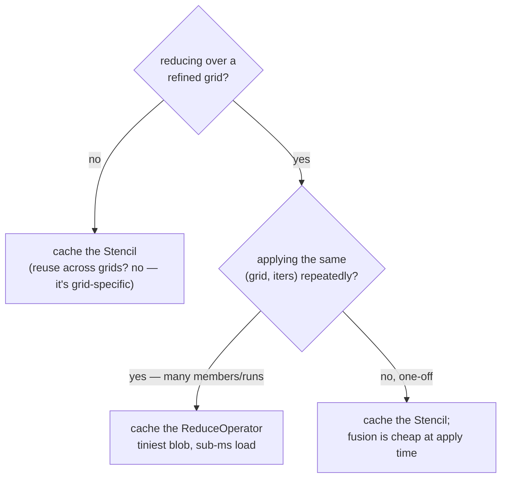

# Caching the precompute

geohalo's whole performance story rests on doing the expensive geometric work **once**.
The cache is what makes "once" stick across processes, machines, and repeated runs.

## What is worth caching

Four objects are pure functions of their inputs and expensive to build:

| Object           | Depends on                                       | Built by                       |
| ---------------- | ------------------------------------------------ | ------------------------------ |
| `Stencil`        | grid coords + spherical flag + polygons          | `get_or_compute_stencil`       |
| `Resampler`      | source/target coords + iterations                | `get_or_compute_resampler`     |
| `BiasTree`       | edges + weights + how                            | `get_or_compute_tree`          |
| `ReduceOperator` | stencil digest + source coords + iterations      | `get_or_compute_reduce_operator` |

None of them depends on the grid **values** — so a single cached object serves every
time step, member, and band on that grid.

## Content-addressed keys

Each object's cache key is a **SHA-256 digest of its inputs**, computed *without building
the object*. A hit returns the stored blob and never runs the expensive build:

```python
def _get_or_compute(self, namespace, digest, compute, serialize, deserialize, force):
    key = digest.hex()[:16]
    if not force:
        blob = self._load(namespace, key)
        if blob is not None:
            return deserialize(blob)
    obj = compute()
    self._store(namespace, key, serialize(obj))
    return obj
```

Because the key is derived from inputs, **any change to those inputs invalidates the
cache implicitly** — edit a polygon, flip the spherical flag, change the iteration count,
and you get a fresh key (and a fresh build) automatically. There is no manual
invalidation to forget.

The digests are also carefully **canonical**:

- a descending-latitude grid and its ascending twin hash **identically**
  (latitudes are sorted before hashing);
- the polygon digest is **order-invariant** (keys are sorted, then `(repr(key),
  WKB(geom))` pairs are hashed), so the order you pass geometries in doesn't matter;
- the spherical flag is mixed in as `b"sph"` / `b"flat"` so a corrected and an
  uncorrected stencil never collide.

## Backends

=== "LocalCache"

    Pickle files under `path/<namespace>/<key>.pkl`, published atomically (write to a
    `.tmp`, then `replace`) so a crash can't leave a half-written blob.

    ```python
    import geohalo as ghl

    cache = ghl.LocalCache("./.geohalo-cache")
    stencil = cache.get_or_compute_stencil(
        da.latitude.values, da.longitude.values, geoms,
    )
    ```

=== "RedisCache"

    Values under `<prefix>:<key>` in Redis — for sharing the precompute across workers or
    machines. Requires the `redis` extra.

    ```python
    import redis
    import geohalo as ghl

    cache = ghl.RedisCache(redis.Redis(host="localhost", port=6379))
    stencil = cache.get_or_compute_stencil(
        da.latitude.values, da.longitude.values, geoms,
    )
    ```

Both backends share all of the get-or-compute and serialisation logic; they differ only
in the `_load` / `_store` primitives. Serialised payloads carry a `version` field so a
format change is rejected loudly rather than mis-read.

## Which object should I cache?



The [`ReduceOperator`](../concepts/reduce-operator.md) is the standout when you refine:
it is orders of magnitude smaller than a materialised `Resampler` and its size is
**independent of the iteration count**. Cache it when you apply the same operator across
many grid slices.

```python
op = cache.get_or_compute_reduce_operator(
    stencil, da.latitude.values, da.longitude.values, iterations=3,
)
out = ghl.reduce_with_operator(da, op)
```

## Cache miss vs hit, measured

From the [benchmark report](../performance.md), building once and loading thereafter:

| object         | region            | miss (build + store) | hit (load) | speedup |
| -------------- | ----------------- | -------------------- | ---------- | ------- |
| Stencil        | Americas (35)     | 1.88 s               | 41 ms      | ~46×    |
| ReduceOperator | Brazil munis (5572), 0.05° | 4.40 s      | 0.6 ms     | ~7100×  |
| BiasTree       | muni → state (5572) | 1.56 s             | 5.2 ms     | ~298×   |

The first run pays for the geometry; every run after it pays for a `read_bytes` and an
`unpickle`.

!!! tip "Force a rebuild"
    Every `get_or_compute_*` takes `force_recompute=True` to bypass the cache and
    overwrite the stored blob — handy after upgrading geohalo or when you want to
    re-time a build.
