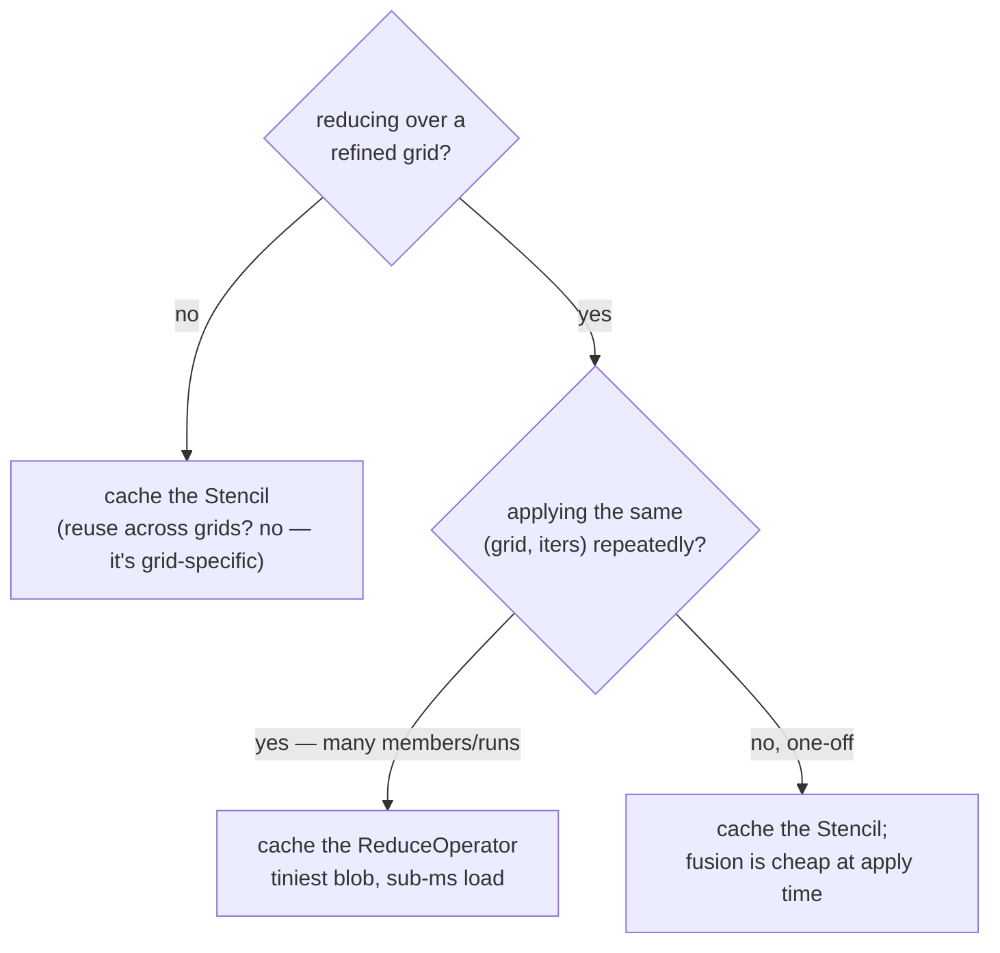

# Caching the precompute

geohalo's whole performance story rests on doing the expensive geometric work **once**.
The cache is what makes "once" stick across processes, machines, and repeated runs.

## What is worth caching

These precomputed objects depend only on their inputs, not on grid values:

| Object           | Depends on                                       | Built by                       |
| ---------------- | ------------------------------------------------ | ------------------------------ |
| `Stencil`        | grid coords + spherical flag + partial-cell weighting + polygons + dtype | `get_or_compute_stencil` |
| `Resampler`      | source/target coords + method + iterations + period + normalization + optional bounds | `get_or_compute_resampler` |
| `BiasTree`       | edges + weights + how                            | `get_or_compute_tree`          |
| `ReduceOperator` | stencil digest + source coords + iterations + dtype + period | `get_or_compute_reduce_operator` |
| `RestrictedOperator` | fused operator digest + stored coords + spatial chunks | `get_or_compute_restricted_operator` |

None of them depends on the grid **values** — so a single cached object serves every
time step, member, and band on that grid.

## Content-addressed keys

Each object's cache key is a **SHA-256 digest of its inputs**, computed *without building
the object*. A hit returns the stored blob and never runs the expensive build:

```python
def _get_or_compute(self, namespace, digest, compute, serialize, deserialize, force):
    key = digest.hex()[:16]
    if not force:
        blob = self._load(namespace, key)
        if blob is not None:
            obj = deserialize(blob)
            if obj.digest != digest:
                raise ValueError("cached object digest does not match requested inputs")
            return obj
    obj = compute()
    self._store(namespace, key, serialize(obj))
    return obj
```

Because the key is derived from inputs, **any change to those inputs invalidates the
cache implicitly** — edit a polygon, flip the spherical flag, change the iteration count,
and you get a fresh key (and a fresh build) automatically. There is no manual
invalidation to forget.

The digests are also carefully **canonical**:

- a descending-latitude grid and its ascending twin hash **identically** for
  canonical grid operators (latitudes are sorted before hashing). A
  [`RestrictedOperator`](../concepts/restricted-operator.md) instead hashes the
  stored orientation because its read windows depend on that order;
- the polygon digest is **order-invariant** for uniquely keyed polygons (keys
  are sorted, then `(repr(key), WKB(geom))` pairs are hashed), so reordering those
  polygons reuses the same cache entry;
- the spherical flag is mixed in as `b"sph"` / `b"flat"` so a corrected and an
  uncorrected stencil never collide.

Geometry hashing uses vectorised WKB encoding. During stencil construction, the
same encoded bytes are reused for extraction and hashing. The digest byte format
is unchanged for default float64 coefficients and `period=None`. The storage
format has changed to NPZ; see [migration](../concepts/serialization.md#migrating-existing-caches).

Both stencil and fused-operator cache methods accept `dtype=np.float32`, matching
their builders. Dtype aliases normalize to the same native float32/float64 type
before hashing; different coefficient dtypes use different cache entries.
Restricted plans inherit that distinction through the fused operator digest.
NPZ coefficient arrays carry their dtype.
The apply-time `preserve_dtype=True` flag does not affect cache keys.

Resampler and fused-operator cache methods accept `period=360` for
[cyclic longitude sampling](resampling.md#periodic-longitude). Periodic and
nonperiodic builds use distinct keys, as do different periods; `360`, `360.0`,
and equivalent NumPy scalar values share a key. Restricted plans inherit the
period through the fused operator digest. Existing `period=None` input digests
are unchanged. The built matrices already encode the period,
so no additional apply-time argument or cache metadata is needed.

For conservative resampling, `get_or_compute_resampler` also accepts
`method="conservative"`, `normalization`, `source_bounds`, and `target_bounds`.
These build options distinguish cache entries; apply-time `skipna` does not.
Source latitude bounds reverse with descending source latitudes, so the
ascending/descending twins still reuse one entry. Explicit versus inferred
bounds may have different keys even if they describe the same physical cells.

Both resampler representations use NPZ schema version 1, distinguished by the
`method` metadata field. Conservative payloads hold two sparse axis matrices
and normalization, with no Kronecker matrix. Mean-preserving payloads hold the
full CSR transform. Default input digests are unchanged.

`partial_cell_weighting="exact"` adds a stencil digest tag. The default
`"approximate"` keeps existing keys. Fused and restricted operators inherit this
distinction through their input digests. Pass the option directly to
`cache.get_or_compute_stencil`; cache hits preserve the mode without recomputing
intersections. Older NPZ stencil metadata without the option loads as approximate.

`Stencil`, `ReduceOperator`, and `RestrictedOperator` payloads store canonical
row order. Their cache methods return **caller-ordered** objects: stencil rows
follow `geoms.index`, fused rows follow `stencil.keys`, and restricted rows follow
`operator.keys`. Cache hits permute sparse rows, normalizers, and labels together;
they never rerun geometry extraction, fusion, or read-plan construction. A digest identifies the canonical
operator, not its returned row layout; use `keys` to interpret matrix rows.

Duplicate labels remain distinct positional rows. Their existing hashing
behavior is unchanged: permuting different geometries with the same label can
produce a different digest. Use unique keys when sharing entries across arbitrary
polygon permutations.

## Backends

=== "LocalCache"

    NPZ files under `path/<namespace>/<key>.npz`, published atomically (write to a
    `.tmp`, then `replace`) so a crash can't leave a half-written blob.

    ```python
    import geohalo as ghl

    cache = ghl.LocalCache("./.geohalo-cache")
    stencil = cache.get_or_compute_stencil(
        da.latitude.values, da.longitude.values, geoms,
    )
    ```

=== "RedisCache"

    NPZ bytes under `geohalo:<namespace>:npz:v1:<key>` in Redis — for sharing the precompute across workers or
    machines. Requires the `redis` extra.

    ```python
    import redis
    import geohalo as ghl

    cache = ghl.RedisCache(redis.Redis(host="localhost", port=6379))
    stencil = cache.get_or_compute_stencil(
        da.latitude.values, da.longitude.values, geoms,
    )
    ```

Both backends share all of the get-or-compute and serialisation logic; they differ only
in the `_load` / `_store` primitives. Payloads contain numeric arrays and typed
JSON metadata, including schema and writer versions. Loading always uses
`allow_pickle=False` and validates structure; cache hits also check the full
stored input digest, not just the truncated storage key. A malformed hit raises
an error; use `force_recompute=True` to replace it explicitly.

The same bytes are available through `obj.to_npz()` and
`Class.from_npz(blob)` for database/object-store persistence. See
[portable operator artifacts](../concepts/serialization.md) for the schema,
supported key types, and security boundaries. Custom Python object labels are
not serializable; use supported scalar or tuple labels instead.

!!! warning "One-time rebuild after upgrading from pickle caches"
    Existing `.pkl` files and old Redis prefixes are ignored, not loaded or
    deleted. The first request for each object rebuilds it into NPZ. There is no
    automatic pickle migration fallback. Input digests are unchanged, and old
    and new deployments use separate storage names.

## Which object should I cache?


```mermaid
flowchart TD
    Q1{"reducing over a<br/>refined grid?"}
    Q1 -->|no| ST["cache the Stencil<br/>(reuse across grids? no — it's grid-specific)"]
    Q1 -->|yes| Q2{"applying the same<br/>(grid, iters) repeatedly?"}
    Q2 -->|"yes — many members/runs"| RO["cache the ReduceOperator<br/>tiniest blob, sub-ms load"]
    Q2 -->|"no, one-off"| ST2["cache the Stencil;<br/>fusion is cheap at apply time"]
```

The [`ReduceOperator`](../concepts/reduce-operator.md) is the standout when you refine:
it is orders of magnitude smaller than a materialised `Resampler` and its size is
**independent of the iteration count**. Cache it when you apply the same operator across
many grid slices.

```python
op = cache.get_or_compute_reduce_operator(
    stencil, da.latitude.values, da.longitude.values, iterations=3,
)
out = ghl.reduce_with_operator(da, op)
```

## Cache miss vs hit, measured

Historical measurements from the [benchmark report](../performance.md), using
the previous cache format; NPZ loading costs have not been rebenchmarked here:

| object         | region            | miss (build + store) | hit (load) | speedup |
| -------------- | ----------------- | -------------------- | ---------- | ------- |
| Stencil        | Americas (35)     | 1.88 s               | 41 ms      | ~46×    |
| ReduceOperator | Brazil munis (5572), 0.05° | 4.40 s      | 0.6 ms     | ~7100×  |
| BiasTree       | muni → state (5572) | 1.56 s             | 5.2 ms     | ~298×   |

The first run pays for the geometry; subsequent runs read NPZ arrays and rebuild
the lightweight operator wrapper without recomputing geometry or fusion.

!!! tip "Force a rebuild"
    Every `get_or_compute_*` takes `force_recompute=True` to bypass the cache and
    overwrite the stored blob — handy after upgrading geohalo or when you want to
    re-time a build.
