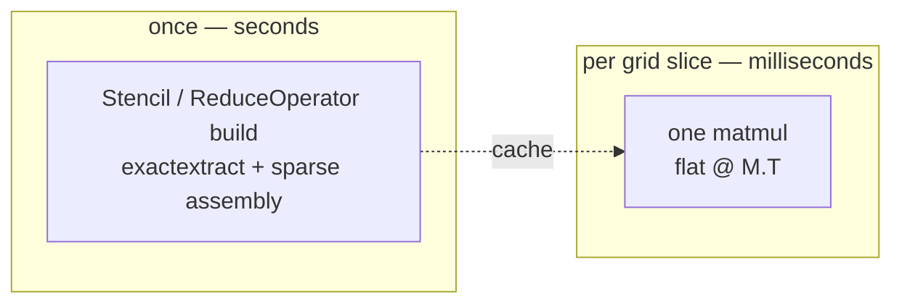
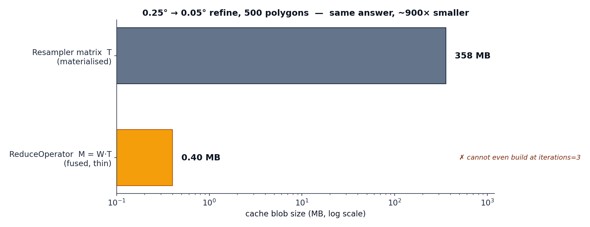

# Performance

The headline claim — *millisecond-scale aggregation in the hot path* — is backed by a
reproducible suite in [`benchmarks/`](https://github.com/campiohe/geohalo/blob/main/benchmarks/run.py).
This page reads the numbers; the [full generated report](benchmark.md) has every row.

```bash
uv run python -m benchmarks.run
```

## The shape of the cost

geohalo deliberately moves all the expensive work into a one-time precompute, leaving a
hot path that is a single sparse · dense matmul.



## Precompute — pay once

Building the [stencil](concepts/stencil.md) scales with polygon count and vertex
complexity; the resulting matrix is small and cacheable.

| n_polygons (GADM Brazil L2) | `Stencil.compute` | CSR size |
| --------------------------- | ----------------- | -------- |
| 50                          | ~21 ms            | 6 KB     |
| 507                         | ~170 ms           | 38 KB    |
| 5571                        | ~2.1 s            | 430 KB   |

After the first build, a [cache](guides/caching.md) hit loads in milliseconds — a
~30–46× speedup for stencils, and **thousands of times** for a refined
[`ReduceOperator`](concepts/reduce-operator.md).

## Hot path — pay per slice

All rows below aggregate to GADM Brazil L2 (~5570 municipalities) on a 0.25° grid over
Brazil (160×160 = 25 600 cells). The batch dims are arbitrary — any stacked non-spatial
dims work; here they follow the ECMWF data the suite happens to use, where `member=50` is
a 50-member ensemble and `step=N` is `N` lead times.

| n_polygons | batch                | slices | factor       | median  |
| ---------- | -------------------- | ------ | ------------ | ------- |
| 50         | (member=50,)         | 50     | 1            | 3.6 ms  |
| 5571       | (member=50,)         | 50     | 1            | 5.8 ms  |
| 5571       | (member=50, step=10) | 500    | 1            | 196 ms  |
| 5571       | (member=50, step=40) | 2 000  | 1            | 670 ms  |
| 5571       | (member=50,)         | 50     | 4 (refined)  | 113 ms  |
| 5571       | (member=50,)         | 50     | 1 (1 % NaN)  | 14 ms   |

A batch of 50 grid slices over 5 571 polygons reduces in **single-digit milliseconds**. The
cost scales with the number of slices (it is one matmul over the flattened batch), and the
[NaN-aware path](concepts/masked.md) costs roughly 2–3× the clean path for its second
matmul.

## The fusion win

For a 0.25° → 0.05° refine (~3.2 M target cells) over 500 polygons, the materialised
[resampler](concepts/downscaling.md) is a 358 MB blob that **cannot build at all** at
`iterations=3`. The [fused `ReduceOperator`](concepts/reduce-operator.md) is a **0.40 MB**
blob, builds in ~0.5 s, and loads in ~0.5 ms — same answer, ~900× smaller.

<figure markdown>
{ width="720" }
</figure>

## Rollups

[Hierarchical rollups](concepts/bias-tree.md) are another matmul. The full GADM Brazil
muni → state hierarchy (5 571 leaves) rolls a batch of 50 slices up in ~5.6 ms; with a
500-slice batch, ~19 ms.

## Caveats

Numbers are point-in-time on the author's machine and vary ±20 % by hardware. Cold-import
overhead (~0.3 s for `import geohalo`) is excluded — the suite measures steady-state cost.
The [full report](benchmark.md) is regenerated after any perf-relevant change and
records the exact environment, hardware, and methodology.
