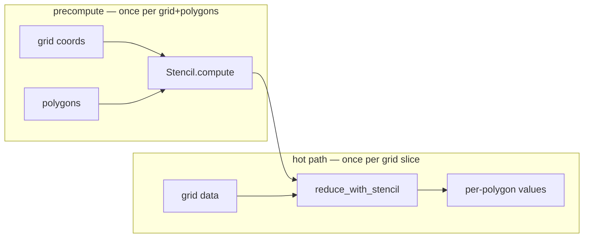

# Quickstart

Every snippet on this page is **self-contained and runnable** — copy, paste, and it
works. We build a synthetic grid so there are no files to download; in your own code,
`da` comes from `xr.open_dataset(...)` (GRIB, NetCDF, Zarr, …) and `geoms` from your own
shapefile or GeoDataFrame.

## Install

geohalo targets Python ≥ 3.12.

```bash
uv add geohalo            # or: pip install geohalo
```

Two features live behind optional extras: `redis` (the
[`RedisCache`](guides/caching.md) backend) and `matplotlib` (the plotting helpers in
`geohalo.plot`).

```bash
uv add "geohalo[redis,matplotlib]"
```

## Set up a grid and polygons

```python
import numpy as np
import geopandas as gpd
import xarray as xr
from shapely.geometry import box
import geohalo as ghl

# a regular 0.25° lat/lon grid + a synthetic 2 m-temperature field (K)
lats = np.arange(-25.0, -19.0, 0.25)
lons = np.arange(-50.0, -42.0, 0.25)
lon2d, lat2d = np.meshgrid(lons, lats)
field = 290.0 + 5.0 * np.cos(np.deg2rad(4 * lat2d)) + 0.1 * lon2d

da = xr.DataArray(
    field,
    dims=("latitude", "longitude"),
    coords={"latitude": lats, "longitude": lons},
    name="t2m",
)

# three polygons (plain boxes here; any shapely geometry works)
geoms = gpd.GeoSeries(
    [box(-49, -24, -47, -22), box(-47, -24, -45, -22), box(-46, -22, -44, -20)],
    index=["SP", "RJ", "MG"],     # the index holds the keys
)
```

!!! tip "The keys live on the index"
    geohalo never invents identifiers. Whatever you put on the `GeoSeries` index — a
    string, a tuple, a `pandas.MultiIndex` — comes back as the `geom` coordinate, so the
    result joins straight back to your metadata.

## Reduce to per-polygon values

```python
out = ghl.reduce(da, geoms)
print(out)
# <xarray.DataArray 't2m' (geom: 3)>
# array([286.02, 285.23, 285.03])
# Coordinates:
#   * geom  (geom) object 'MG' 'RJ' 'SP'
```

The output replaces `(latitude, longitude)` with a single `geom` dim and keeps every
other dim untouched. (Polygons are processed in sorted-key order, so `geom` comes back
sorted — `sel` by key whenever order matters.)

## Batch dimensions come for free

Stack as many non-spatial dims as you like — time steps, ensemble members, bands, levels. They
are flattened, run through **one** matmul, and reshaped back.

```python
rng = np.random.default_rng(0)
ens = field[None] + rng.normal(0, 1.0, size=(50, *field.shape))   # 50 members

da_ens = xr.DataArray(
    ens,
    dims=("member", "latitude", "longitude"),
    coords={"member": np.arange(50), "latitude": lats, "longitude": lons},
    name="t2m",
)

out = ghl.reduce(da_ens, geoms)
print(out.dims, out.shape)        # ('member', 'geom') (50, 3)
```

## Datasets work too

Pass an `xr.Dataset` and every data variable carrying the spatial dims is reduced; the
rest pass through.

```python
ds = xr.Dataset({"t2m": da, "tp": da * 0 + 3.0})   # two spatial vars
out = ghl.reduce(ds, geoms)
print(list(out.data_vars))        # ['t2m', 'tp']
```

## Weighted means with `weight_key`

For a weighted mean — population-weighted temperature, area-weighted anything — attach a
per-cell weight field and name it with `weight_key`. Here we build a synthetic
population grid, add it to the data as a coordinate, and reduce against it:

```python
# a per-cell weight field on the same grid (e.g. population density)
weight = np.abs(rng.normal(1000.0, 400.0, size=field.shape))

# attach it as a coordinate so geohalo can look it up by name
da_w = da.assign_coords(population=(("latitude", "longitude"), weight))

out = ghl.reduce(da_w, geoms, weight_key="population")
print(out.values)                 # population-weighted mean per polygon
```

Each polygon's value becomes \(\sum_j W_{ij}\,w_j\,x_j \big/ \sum_j W_{ij}\,w_j\) — the
cell weights multiply the geometric area weights. A `NaN` in the weight field drops that
cell. See [NaN-aware & weighted reduction](concepts/masked.md) for the full story.

!!! note "Weights on a `Dataset`"
    With a `Dataset` you can instead carry the weight as a **data variable**:
    `xr.Dataset({"t2m": da, "population": (("latitude", "longitude"), weight)})` and call
    `reduce(ds, geoms, weight_key="population")`. The weight variable is reduced too and
    appears in the output — select the variable you care about (`out["t2m"]`).

## Missing data is handled automatically

When some cells are `NaN` (outside the domain, masked ocean, a sensor gap), geohalo drops
them from each polygon's average and **renormalises by the valid area** — no flag needed.

```python
masked = field.copy()
masked[lat2d > -21.0] = np.nan          # blank out the northern strip

da_nan = xr.DataArray(
    masked,
    dims=("latitude", "longitude"),
    coords={"latitude": lats, "longitude": lons},
    name="t2m",
)

out = ghl.reduce(da_nan, geoms)         # NaN-aware; a polygon with no valid cell → NaN
print(out.values)
```

## Sub-cell precision: refine first

Polygons smaller than a cell get a sharper answer if you refine the grid with
[mean-preserving downscaling](concepts/downscaling.md) before reducing — geohalo fuses
the refine and the reduce into one operator, so the fine grid is never materialised.

```python
out = ghl.reduce(da, geoms, target_resolution=0.05)              # refine 0.25° → 0.05°
out = ghl.reduce(da, geoms, target_resolution=0.05, resample_iterations=3)   # smoother
```

## Separate the precompute from the hot path

`reduce` builds the operator and applies it in one call. For repeated calls (many grids
sharing the same grid + polygons), build it once, [cache it](guides/caching.md), and
reuse:

```python
cache = ghl.LocalCache("./.geohalo-cache")
stencil = cache.get_or_compute_stencil(da.latitude.values, da.longitude.values, geoms)

out = ghl.reduce_with_stencil(da_ens, stencil)    # reuse for every slice
```



## Common options

`reduce` (and `reduce_with_stencil`) accept:

| Argument                | Default                       | Effect                                                                                       |
| ----------------------- | ----------------------------- | -------------------------------------------------------------------------------------------- |
| `how`                   | `"mean"`                      | `"mean"` (area-weighted) or `"sum"` (area-weighted total)                                    |
| `target_resolution`     | `None`                        | refine the grid to this step before reducing — [sub-cell precision](concepts/downscaling.md) |
| `resample_iterations`   | `1`                           | smoothing passes of the mean-preserving refine                                               |
| `weight_key`            | `None`                        | name of a per-cell weight variable                                                           |
| `spherical_correction`  | `True`                        | divide each cell's weight by its true spherical area                                         |
| `lat_dim` / `lon_dim`   | `"latitude"` / `"longitude"`  | rename the spatial dims                                                                       |
| `geom_dim`              | `"geom"`                      | rename the output polygon dim                                                                 |

```python
out = ghl.reduce(da, geoms, how="sum")
out = ghl.reduce(da, geoms, spherical_correction=False)   # planar / equal-area weights
```

## Roll up a hierarchy

If leaf polygons belong to a parent grouping (municipalities → states → country), one more
matmul rolls them up. The DataFrame index is the **child**; the `parent` column is its
parent.

```python
import pandas as pd

out = ghl.reduce(da, geoms)                   # leaf values for SP, RJ, MG

edges = pd.DataFrame(
    {"parent": ["BR", "BR", "BR"]},
    index=pd.Index(["SP", "RJ", "MG"], name="geom"),
)

rolled = ghl.aggregate_bias(out, edges)       # carries leaves AND the parent 'BR'
print(dict(zip(rolled.geom.values, rolled.values.round(2))))
# {'MG': 286.02, 'RJ': 285.23, 'SP': 285.03, 'BR': 285.43}
```

See [Hierarchical rollups](concepts/bias-tree.md) for weights, `how="sum"`, and deeper
trees.
